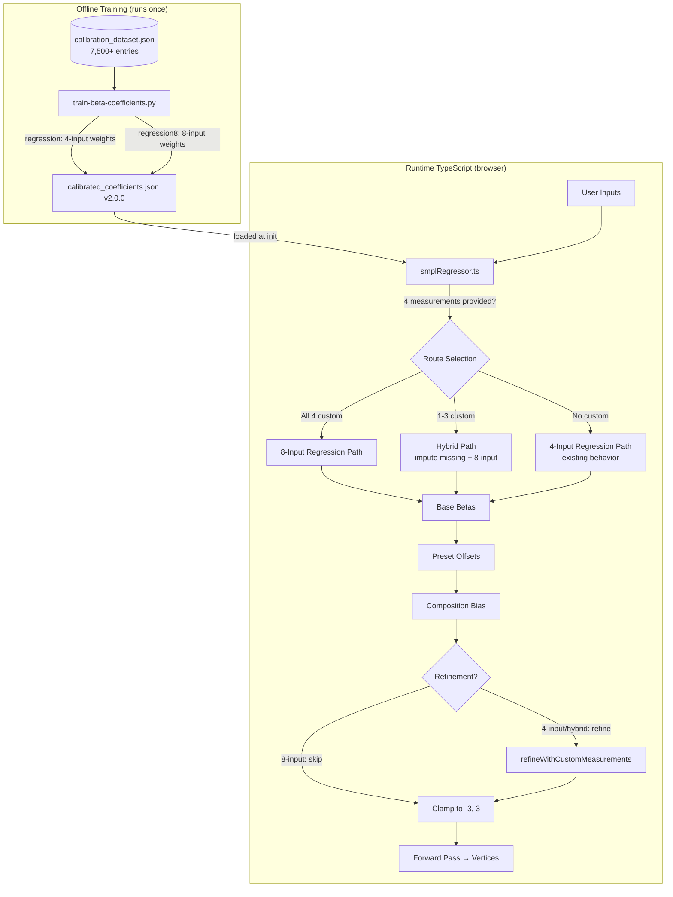
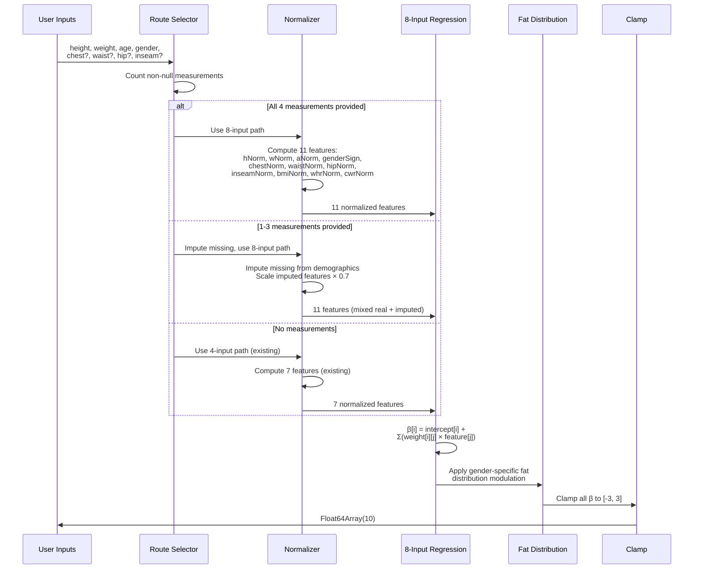

# Design Document: 8-Input Regression

## Overview

This design extends the SMPL beta regressor from 4 demographic inputs to 8 inputs by adding chest, waist, hip, and inseam measurements as direct regression features. The existing calibration dataset (`scripts/data/calibration_dataset.json`, 7,500+ entries) already contains all the data needed — each entry has heightCm, weightKg, age, gender, chestCm, waistCm, hipCm, shoulderCm, inseamCm, and 10 betas.

The approach is straightforward:

1. **Training**: Extend `scripts/train-beta-coefficients.py` to train a second regression model using 11 normalized features (8 inputs + 3 interaction terms) → 10 betas. Export both models to the coefficient table.
2. **Runtime**: Extend `lookupRegress()` in `smplRegressor.ts` to select the 8-input model when custom measurements are available, falling back to the existing 4-input model otherwise.
3. **Hybrid path**: When 1–3 measurements are provided, impute the missing ones from demographics and use the 8-input model with confidence weighting.
4. **Pipeline optimization**: Skip the refinement loop when the 8-input model was used with all 4 measurements, since the betas already incorporate them directly.

### Key Design Decisions

- **Ridge regression (same as 4-input)**: The 8-input mapping is still smooth and low-dimensional. Ridge regression with interaction terms is sufficient, interpretable, and produces a tiny JSON artifact. No neural network or ONNX needed.
- **Interaction terms**: Include waist-to-hip ratio, chest-to-waist ratio, and BMI as features. These capture body shape proportions that individual measurements alone miss (e.g., two people with the same waist but different hip-to-waist ratios have very different body shapes).
- **Dual-model coefficient table**: Store both 4-input and 8-input weights in the same JSON file under `regression` and `regression8` keys. Version bump to 2.0.0 with backward-compatible loading of 1.0.0 files.
- **Confidence-weighted hybrid**: When measurements are partially provided, impute missing ones from demographics but scale imputed features by 0.7 to reduce their influence. This is simpler than training separate models for every combination of missing inputs.
- **Skip refinement for full 8-input**: When all 4 measurements are regression inputs, the betas already encode them. Running the iterative refinement loop on top would be redundant and could introduce drift.
- **`bustCm` vs `chestCm` mapping**: The store uses `bustCm` while the calibration dataset uses `chestCm`. These are treated as equivalent — the regressor maps `bustCm` from `RegressorInputs` to the `chestNorm` feature.

## Architecture



### Data Flow: 8-Input lookupRegress()



## Components and Interfaces

### 1. Extended Coefficient Trainer (`scripts/train-beta-coefficients.py`)

Modifications to the existing training script to produce both 4-input and 8-input models.

**New 8-input feature set** (11 features total):

| # | Feature | Formula | Center | Range |
|---|---------|---------|--------|-------|
| 0 | heightNorm | (heightCm - 175) / 20 | 175 | 20 |
| 1 | weightNorm | (weightKg - 80) / 30 | 80 | 30 |
| 2 | ageNorm | (age - 40) / 25 | 40 | 25 |
| 3 | genderSign | male=1, female=-1 | 0 | 1 |
| 4 | chestNorm | (chestCm - 96) / 15 | 96 | 15 |
| 5 | waistNorm | (waistCm - 82) / 15 | 82 | 15 |
| 6 | hipNorm | (hipCm - 98) / 15 | 98 | 15 |
| 7 | inseamNorm | (inseamCm - 80) / 10 | 80 | 10 |
| 8 | bmiNorm | (bmi - 25) / 8 | 25 | 8 |
| 9 | whrNorm | waistCm / hipCm (raw ratio) | 0.85 | 0.15 |
| 10 | cwrNorm | chestCm / waistCm (raw ratio) | 1.15 | 0.2 |

**Training process**:
1. Load `scripts/data/calibration_dataset.json`
2. Compute 11-feature matrix from all entries (each entry has all 8 raw inputs)
3. Fit per-beta Ridge regression: `β[i] = intercept8[i] + Σ(weight8[i][j] × feature8[j])`
4. 5-fold cross-validate, assert MAE < 0.15 per beta component
5. Log comparison with 4-input model MAE
6. Export under `regression8` key in the coefficient table

**Output changes to `calibrated_coefficients.json`**:
- Version bumped to `"2.0.0"`
- New `regression8` key with same structure as `regression`:
  ```json
  {
    "regression8": {
      "intercepts": [/* 10 values */],
      "weights": [/* 10 × 11 matrix */],
      "features": ["heightNorm", "weightNorm", "ageNorm", "genderSign",
                    "chestNorm", "waistNorm", "hipNorm", "inseamNorm",
                    "bmiNorm", "whrNorm", "cwrNorm"],
      "normalization": {
        "heightNorm": {"center": 175, "range": 20},
        "weightNorm": {"center": 80, "range": 30},
        "ageNorm": {"center": 40, "range": 25},
        "genderSign": {"center": 0, "range": 1},
        "chestNorm": {"center": 96, "range": 15},
        "waistNorm": {"center": 82, "range": 15},
        "hipNorm": {"center": 98, "range": 15},
        "inseamNorm": {"center": 80, "range": 10},
        "bmiNorm": {"center": 25, "range": 8},
        "whrNorm": {"center": 0.85, "range": 0.15},
        "cwrNorm": {"center": 1.15, "range": 0.2}
      }
    }
  }
  ```

### 2. Extended CalibratedCoefficients Interface

```typescript
export interface RegressionBlock {
  intercepts: number[];             // [10] per-beta intercept
  weights: number[][];              // [10][N] per-beta, per-feature weights
  features: string[];               // feature names in order
  normalization: {
    [feature: string]: { center: number; range: number };
  };
}

export interface CalibratedCoefficients {
  version: string;                    // "2.0.0" (was "1.0.0")
  generatedAt: string;                // ISO 8601

  regression: RegressionBlock;        // 4-input model (existing)
  regression8?: RegressionBlock;      // 8-input model (new, optional for backward compat)

  presetOffsets: { /* unchanged */ };
  compositionBias: { /* unchanged */ };
  sensitivityMap: { /* unchanged */ };
  fatDistribution: { /* unchanged */ };
}
```

### 3. Modified `lookupRegress()` in `smplRegressor.ts`

The function gains a three-way routing logic:

```typescript
export function lookupRegress(inputs: RegressorInputs): Float64Array {
  if (calibratedCoeffs == null) {
    // Heuristic fallback (existing code, unchanged)
    return heuristicRegress(inputs);
  }

  // Count how many custom measurements are provided
  const hasChest = inputs.bustCm != null;
  const hasWaist = inputs.waistCm != null;
  const hasHip = inputs.hipCm != null;
  const hasInseam = inputs.inseamCm != null;
  const customCount = +hasChest + +hasWaist + +hasHip + +hasInseam;

  // Route: 8-input (all 4), hybrid (1-3), or 4-input (0)
  if (customCount > 0 && calibratedCoeffs.regression8 != null) {
    return regress8Input(inputs, customCount === 4);
  }

  // 4-input path (existing calibrated code, unchanged)
  return regress4Input(inputs);
}
```

**`regress8Input()` implementation**:
1. Resolve all 4 measurement values (real or imputed)
2. Compute 11 normalized features
3. Apply confidence scaling (1.0 for real, 0.7 for imputed) to measurement features only
4. Compute `β[i] = intercept8[i] + Σ(weight8[i][j] × feature[j])`
5. Apply fat distribution modulation (same as 4-input path)
6. Clamp to [-3, 3]

**Imputation for hybrid path**:
```typescript
function imputeMissingMeasurements(inputs: RegressorInputs): {
  chestCm: number; waistCm: number; hipCm: number; inseamCm: number;
  chestReal: boolean; waistReal: boolean; hipReal: boolean; inseamReal: boolean;
} {
  // Try ANSUR lookup first, fall back to predictMeasurementsFromDemographics()
  const predicted = lookupAnsurMeasurements(inputs.heightCm, inputs.weightKg, inputs.age, inputs.gender)
    ?? predictMeasurementsFromDemographics(inputs.heightCm, inputs.weightKg, inputs.age, inputs.gender);

  return {
    chestCm: inputs.bustCm ?? predicted.chestCm,
    waistCm: inputs.waistCm ?? predicted.waistCm,
    hipCm: inputs.hipCm ?? predicted.hipCm,
    inseamCm: inputs.inseamCm ?? predicted.inseamCm,
    chestReal: inputs.bustCm != null,
    waistReal: inputs.waistCm != null,
    hipReal: inputs.hipCm != null,
    inseamReal: inputs.inseamCm != null,
  };
}
```

**Confidence scaling**: For each measurement feature, if the value was imputed (not user-provided), multiply the normalized feature value by 0.7 before feeding it into the regression. This reduces the influence of uncertain imputed values while still providing a better starting point than demographics alone.

### 4. Modified `computeSmplBetas()` Pipeline

The pipeline gains awareness of which regression path was used:

```typescript
export function computeSmplBetas(inputs: PipelineInputs, model?: SmplModelData | null): Float64Array {
  // Step 1: base regression (now routes to 4-input, 8-input, or hybrid)
  const betas = lookupRegress(inputs);

  // Step 2: body type preset offsets (unchanged)
  if (inputs.bodyType != null && inputs.bodyType !== 'average') {
    applyPresetOffsets(betas, inputs.bodyType);
  }

  // Step 3: body composition bias (unchanged)
  const composition = inputs.bodyComposition ?? 'average';
  if (composition !== 'average') {
    applyCompositionBias(betas, composition);
  }

  // Step 4: custom measurement refinement
  // SKIP refinement when 8-input model was used with all 4 measurements
  const used8InputFull = calibratedCoeffs?.regression8 != null
    && inputs.bustCm != null && inputs.waistCm != null
    && inputs.hipCm != null && inputs.inseamCm != null;

  if (!used8InputFull) {
    // Build targets and refine (existing logic for 4-input and hybrid paths)
    const targets = buildRefinementTargets(inputs);
    if (Object.keys(targets).length > 0) {
      refineWithCustomMeasurements(betas, targets, model);
    }
  }

  // Step 5: final clamp (unchanged)
  for (let i = 0; i < 10; i++) {
    betas[i] = clamp(betas[i], -3, 3);
  }

  return betas;
}
```

### 5. Version Loading Logic

```typescript
const ACCEPTED_VERSIONS = ['1.0.0', '2.0.0'];

export async function loadCalibratedCoefficients(url?: string): Promise<CalibratedCoefficients | null> {
  try {
    const resp = await fetch(url ?? '/data/calibrated_coefficients.json');
    if (!resp.ok) return null;
    const data: CalibratedCoefficients = await resp.json();

    if (!ACCEPTED_VERSIONS.includes(data.version)) {
      console.warn(`[SmplRegressor] Coefficient version ${data.version} not supported`);
      return null;
    }

    if (data.version === '1.0.0' && !data.regression8) {
      console.info('[SmplRegressor] v1.0.0 coefficients loaded (4-input only, 8-input not available)');
    }

    calibratedCoeffs = data;
    return data;
  } catch (e) {
    console.warn('[SmplRegressor] Failed to load calibrated coefficients:', e);
    return null;
  }
}
```

### 6. Validation Test Suite Extension

Extend `smplRegressor.validation.test.ts` to test both paths:

- **4-input validation** (existing): demographics-only → betas → mesh → extract → compare with ANSUR ground truth
- **8-input validation** (new): demographics + measurements → betas → mesh → extract → compare with input measurements
- **Comparison report**: side-by-side accuracy table for both models

### 7. Property-Based Test Extension

New property tests in `smplRegressor.prop.test.ts`:

- Generate random 8-input combinations within physiologically valid ranges
- Run full round-trip: inputs → `computeSmplBetas()` → `computeSmplVertices()` → `extractMeasurements()`
- Assert each extracted measurement is within 5cm of the corresponding input measurement
- 50 iterations per property

## Data Models

### Extended Coefficient Table (v2.0.0)

```typescript
interface ExtendedCoefficientTable {
  version: "2.0.0";
  generatedAt: string;

  // 4-input model (backward compatible)
  regression: {
    intercepts: number[];           // [10]
    weights: number[][];            // [10][7]
    features: string[];             // 7 feature names
    normalization: Record<string, { center: number; range: number }>;
  };

  // 8-input model (new)
  regression8: {
    intercepts: number[];           // [10]
    weights: number[][];            // [10][11]
    features: string[];             // 11 feature names
    normalization: Record<string, { center: number; range: number }>;
  };

  // All other fields unchanged
  presetOffsets: Record<string, number[]>;
  compositionBias: Record<string, number[]>;
  sensitivityMap: Record<string, Array<{ betaIdx: number; sensitivity: number }>>;
  fatDistribution: Record<string, { weightToBeta: number[]; ageFactor: number[] }>;
}
```

### Imputed Measurements Result

```typescript
interface ImputedMeasurements {
  chestCm: number;
  waistCm: number;
  hipCm: number;
  inseamCm: number;
  chestReal: boolean;
  waistReal: boolean;
  hipReal: boolean;
  inseamReal: boolean;
}
```

## Correctness Properties

### Property 1: 8-Input Beta Boundedness (Invariant)
- **Requirement**: 2.4
- **Type**: Invariant
- **Property**: For all valid 8-input combinations (height 140–210, weight 40–160, age 18–80, male/female, chest 60–150, waist 55–160, hip 65–160, inseam 55–100), `lookupRegress()` produces a Float64Array of length 10 where every element is finite and in [-3, 3].
- **Testable**: yes — property-based test with fast-check generating random valid 8-input combinations.

### Property 2: 4-Input Path Identity (Idempotence / Backward Compatibility)
- **Requirement**: 2.2, 9.1
- **Type**: Invariant
- **Property**: For all valid demographics-only inputs (no custom measurements), `lookupRegress()` with the extended coefficient table produces identical output to `lookupRegress()` with the 4-input-only coefficient table. The 8-input extension does not alter the demographics-only path.
- **Testable**: yes — property-based test comparing outputs with and without `regression8` key present.

### Property 3: 8-Input Round-Trip Chest (Metamorphic)
- **Requirement**: 6.2
- **Type**: Round-trip
- **Property**: For all randomly generated valid 8-input combinations, the full pipeline (inputs → `computeSmplBetas()` → `computeSmplVertices()` → `extractMeasurements()`) produces an extracted chest circumference within 5cm of the input `bustCm` value.
- **Testable**: yes — property-based test, 50+ iterations, SMPL model loaded once.

### Property 4: 8-Input Round-Trip Waist (Metamorphic)
- **Requirement**: 6.3
- **Type**: Round-trip
- **Property**: For all randomly generated valid 8-input combinations, the extracted waist circumference is within 5cm of the input `waistCm` value.
- **Testable**: yes — property-based test, 50+ iterations.

### Property 5: 8-Input Round-Trip Hip (Metamorphic)
- **Requirement**: 6.4
- **Type**: Round-trip
- **Property**: For all randomly generated valid 8-input combinations, the extracted hip circumference is within 5cm of the input `hipCm` value.
- **Testable**: yes — property-based test, 50+ iterations.

### Property 6: 8-Input Round-Trip Inseam (Metamorphic)
- **Requirement**: 6.5
- **Type**: Round-trip
- **Property**: For all randomly generated valid 8-input combinations, the extracted inseam is within 5cm of the input `inseamCm` value.
- **Testable**: yes — property-based test, 50+ iterations.

### Property 7: Refinement Skip for Full 8-Input (Invariant)
- **Requirement**: 4.3
- **Type**: Invariant
- **Property**: When all 4 custom measurements are provided and the 8-input model is available, `computeSmplBetas()` produces the same betas as `lookupRegress()` + preset offsets + composition bias + clamp (no refinement step). The refinement loop is skipped.
- **Testable**: yes — property-based test comparing `computeSmplBetas()` output with manually composed pipeline output.

### Property 8: Hybrid Path Intermediate Accuracy (Metamorphic)
- **Requirement**: 3.1
- **Type**: Metamorphic
- **Property**: For any input with 1–3 real measurements and the rest imputed, the hybrid path produces betas that differ from both the 4-input path (no measurements) and the full 8-input path (all measurements real). The hybrid output is not identical to either extreme.
- **Testable**: yes — property-based test generating random partial measurement combinations.

### Property 9: Coefficient Table Parse-Serialize Round-Trip
- **Requirement**: 10.1, 10.2
- **Type**: Round-trip
- **Property**: For all valid coefficient table JSON objects, `JSON.parse(JSON.stringify(table))` produces an object where all numeric values in `regression.weights`, `regression.intercepts`, `regression8.weights`, and `regression8.intercepts` match the originals within 1e-10.
- **Testable**: yes — property-based test generating random coefficient structures.
