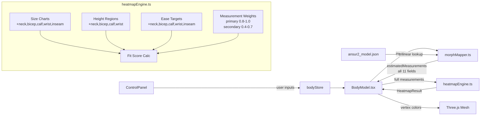

# Better Fit Calculation — Design Document

## Overview

This feature expands the heatmap fit calculation from 3–5 measurement points per garment to 5–9 points by leveraging all measurements already predicted by the ML model (`ansur2_model.json`). Currently, `estimatedMeasurements()` returns only 6 fields (bust, waist, hip, highHip, inseam, bmi), while the ML model predicts 10 circumference measurements. The heatmap engine also derives thigh and shoulder from rough ratios (`hip × 0.56`, `bust × 0.45`) instead of using the ML model's direct predictions.

The changes span four modules:

1. **morphMapper.ts** — Expand `estimatedMeasurements()` to return all 10 ML-predicted measurements plus BMI.
2. **heatmapEngine.ts** — Add height regions, expand size charts, add ease targets, introduce per-measurement weighting, and accept the expanded measurements object.
3. **BodyModel.tsx** — Pass the full measurements object to `computeHeatmap()` (minimal change).
4. No new files or dependencies are required.

### Design Rationale

- **Direct ML predictions over derived estimates**: The ML model was trained on 29k subjects and predicts each measurement independently. Using `hip × 0.56` for thigh introduces systematic error that the model doesn't have.
- **Per-measurement weighting**: Adding secondary measurements (wrist, calf) without weighting would dilute the influence of primary fit zones (chest, waist, hip). Weighting preserves the current heatmap behavior for primary zones while adding granularity from secondary zones.
- **Backward compatibility**: The fit score range [-1, +1] and `fitScoreToColor` mapping remain unchanged. When all weights are 1.0, the blending formula reduces to the current unweighted behavior.

## Architecture



### Data Flow (Changed)

1. `BodyModel.tsx` calls `estimatedMeasurements(inputs)` → now returns 11 fields instead of 6.
2. `BodyModel.tsx` passes the full object to `computeHeatmap()` → signature accepts expanded type.
3. `computeHeatmap()` builds `bodyMap` from the measurements object directly (no more derived estimates).
4. For each `heightToMeasurement` region that has a matching garment size chart entry, compute ease → fit score, applying the region's `measurementWeight` during Gaussian blending.

## Components and Interfaces

### 1. `estimatedMeasurements()` — morphMapper.ts

**Current signature:**
```typescript
function estimatedMeasurements(u: UserInputs): {
  bustCm: number; waistCm: number; hipCm: number;
  highHipCm: number; inseamCm: number; bmi: number;
}
```

**New signature:**
```typescript
interface EstimatedMeasurements {
  bustCm: number;
  waistCm: number;
  hipCm: number;
  highHipCm: number;
  inseamCm: number;
  shoulderCm: number;
  neckCm: number;
  bicepCm: number;
  thighCm: number;
  calfCm: number;
  wristCm: number;
  bmi: number;
}

function estimatedMeasurements(u: UserInputs): EstimatedMeasurements
```

**Behavior:**
- Each field uses the user's custom override if provided (bustCm, waistCm, hipCm, highHipCm, inseamCm), otherwise falls back to `lookupMeasurement()`.
- New fields (shoulderCm, neckCm, bicepCm, thighCm, calfCm, wristCm) always come from `lookupMeasurement()` since there are no user overrides for them in `UserInputs`.
- All circumference values are `Math.round()`ed. BMI is rounded to 1 decimal.

### 2. `computeHeatmap()` — heatmapEngine.ts

**Current signature:**
```typescript
function computeHeatmap(
  garmentType: GarmentType, size: string, fitPref: FitPreference,
  bodyMeasurements: { bustCm: number; waistCm: number; hipCm: number; inseamCm: number },
): HeatmapResult | null
```

**New signature:**
```typescript
interface BodyMeasurementsInput {
  bustCm: number;
  waistCm: number;
  hipCm: number;
  inseamCm: number;
  shoulderCm: number;
  neckCm: number;
  bicepCm: number;
  thighCm: number;
  calfCm: number;
  wristCm: number;
}

function computeHeatmap(
  garmentType: GarmentType, size: string, fitPref: FitPreference,
  bodyMeasurements: BodyMeasurementsInput,
): HeatmapResult | null
```

**Key changes inside `computeHeatmap()`:**
- `bodyMap` is built directly from the measurements object — no more `hipCm * 0.56` or `bustCm * 0.45`.
- Gaussian blending loop multiplies each region's Gaussian weight by its `measurementWeight` before summing.

### 3. `heightToMeasurement` — heatmapEngine.ts

**Current (5 regions):**
| measurement | hCenter | hWidth |
|-------------|---------|--------|
| shoulder    | 0.77    | 0.03   |
| chest       | 0.68    | 0.05   |
| waist       | 0.58    | 0.04   |
| hip         | 0.50    | 0.04   |
| thigh       | 0.36    | 0.06   |

**New (9 regions):**
| measurement | hCenter | hWidth | measurementWeight | rationale |
|-------------|---------|--------|-------------------|-----------|
| neck        | 0.85    | 0.03   | 0.5               | Per PROJECT_MASTER landmarks |
| shoulder    | 0.77    | 0.03   | 0.9               | Primary fit zone for tops |
| chest       | 0.68    | 0.05   | 1.0               | Primary fit zone |
| bicep       | 0.62    | 0.04   | 0.6               | Secondary — arm zone |
| waist       | 0.58    | 0.04   | 1.0               | Primary fit zone |
| hip         | 0.50    | 0.04   | 0.9               | Primary fit zone |
| wrist       | 0.48    | 0.03   | 0.4               | Secondary — only relevant for long sleeves |
| thigh       | 0.36    | 0.06   | 0.9               | Primary fit zone for bottoms |
| calf        | 0.18    | 0.05   | 0.5               | Secondary — lower leg |

**Note on wrist hCenter (0.48):** This matches the oxford `sleeveEnd` value and the PROJECT_MASTER landmark for wrist height. The wrist region only contributes to fit scoring when the garment's size chart includes a wrist measurement (oxford only).

### 4. Garment Size Charts — heatmapEngine.ts

**Tee (expanded):**
```typescript
sizes: {
  'XS': { chest: 90, waist: 86, shoulder: 42, neck: 36, bicep: 30 },
  'S':  { chest: 96, waist: 92, shoulder: 44, neck: 37, bicep: 32 },
  'M':  { chest: 102, waist: 98, shoulder: 46, neck: 38, bicep: 34 },
  'L':  { chest: 108, waist: 104, shoulder: 48, neck: 39, bicep: 36 },
  'XL': { chest: 116, waist: 112, shoulder: 50, neck: 41, bicep: 38 },
  'XXL':{ chest: 124, waist: 120, shoulder: 52, neck: 43, bicep: 40 },
}
```

**Oxford (expanded — includes wrist):**
```typescript
sizes: {
  'XS': { chest: 94, waist: 88, shoulder: 43, neck: 37, bicep: 31, wrist: 17 },
  'S':  { chest: 100, waist: 94, shoulder: 45, neck: 38, bicep: 33, wrist: 18 },
  'M':  { chest: 106, waist: 100, shoulder: 47, neck: 39, bicep: 35, wrist: 19 },
  'L':  { chest: 112, waist: 106, shoulder: 49, neck: 41, bicep: 37, wrist: 20 },
  'XL': { chest: 120, waist: 114, shoulder: 51, neck: 43, bicep: 39, wrist: 21 },
  'XXL':{ chest: 128, waist: 122, shoulder: 53, neck: 45, bicep: 41, wrist: 22 },
}
```

**Slim Jeans (expanded):**
```typescript
sizes: {
  '28': { waist: 74, hip: 92, thigh: 54, calf: 34, inseam: 76 },
  '30': { waist: 79, hip: 97, thigh: 56, calf: 36, inseam: 78 },
  '32': { waist: 84, hip: 102, thigh: 58, calf: 38, inseam: 80 },
  '34': { waist: 89, hip: 107, thigh: 61, calf: 40, inseam: 82 },
  '36': { waist: 94, hip: 112, thigh: 64, calf: 42, inseam: 84 },
  '38': { waist: 99, hip: 117, thigh: 67, calf: 44, inseam: 86 },
}
```

**Straight Jeans (expanded):**
```typescript
sizes: {
  '28': { waist: 76, hip: 94, thigh: 56, calf: 36, inseam: 76 },
  '30': { waist: 81, hip: 99, thigh: 58, calf: 38, inseam: 78 },
  '32': { waist: 86, hip: 104, thigh: 60, calf: 40, inseam: 80 },
  '34': { waist: 91, hip: 109, thigh: 63, calf: 42, inseam: 82 },
  '36': { waist: 96, hip: 114, thigh: 66, calf: 44, inseam: 84 },
  '38': { waist: 101, hip: 119, thigh: 69, calf: 46, inseam: 86 },
}
```

### 5. Ease Targets — heatmapEngine.ts

New measurements added to all five fit preferences. Values reflect anatomical fit tolerance (neck and wrist have tighter ranges than chest/hip):

| measurement | compression | slim | regular | relaxed | oversized |
|-------------|-------------|------|---------|---------|-----------|
| chest       | [-2, 1]     | [2, 6] | [6, 11] | [11, 17] | [17, 25] |
| waist       | [-2, 1]     | [0, 4] | [4, 9]  | [9, 15]  | [15, 22] |
| hip         | [-1, 2]     | [2, 6] | [6, 11] | [11, 18] | [18, 26] |
| thigh       | [-1, 2]     | [1, 4] | [4, 8]  | [8, 14]  | [14, 22] |
| shoulder    | [0, 1]      | [1, 3] | [2, 5]  | [4, 8]   | [8, 14]  |
| neck        | [0, 1]      | [1, 2] | [2, 4]  | [4, 7]   | [7, 11]  |
| bicep       | [-1, 1]     | [1, 3] | [3, 6]  | [6, 10]  | [10, 16] |
| calf        | [-1, 1]     | [1, 3] | [3, 6]  | [6, 10]  | [10, 16] |
| wrist       | [0, 0.5]    | [0.5, 1.5] | [1.5, 3] | [3, 5] | [5, 8]  |
| inseam      | [-1, 1]     | [-1, 2] | [0, 3]  | [2, 5]   | [4, 8]   |

### 6. Weighted Gaussian Blending — heatmapEngine.ts

**Current blending:**
```typescript
for (const rf of regionFits) {
  const dist = Math.abs(h - rf.hCenter);
  const w = Math.exp(-(dist * dist) / (2 * rf.hWidth * rf.hWidth));
  totalWeight += w;
  weightedScore += w * rf.fitScore;
}
const fitScore = totalWeight > 0 ? weightedScore / totalWeight : 0;
```

**New blending:**
```typescript
for (const rf of regionFits) {
  const dist = Math.abs(h - rf.hCenter);
  const gaussianW = Math.exp(-(dist * dist) / (2 * rf.hWidth * rf.hWidth));
  const w = gaussianW * rf.measurementWeight;
  totalWeight += w;
  weightedScore += w * rf.fitScore;
}
const fitScore = totalWeight > 0 ? weightedScore / totalWeight : 0;
```

When all `measurementWeight` values are 1.0, this is mathematically identical to the current formula.

### 7. BodyModel.tsx Changes

Minimal — the only change is that `estimatedMeasurements(inputs)` now returns more fields, and the full object is passed to `computeHeatmap()`. The vertex processing, normal reading, and color assignment logic remain unchanged.

## Data Models

### EstimatedMeasurements (new exported interface)

```typescript
interface EstimatedMeasurements {
  bustCm: number;       // chest circumference
  waistCm: number;      // waist circumference
  hipCm: number;        // hip circumference
  highHipCm: number;    // high hip (derived: waist*0.4 + hip*0.6)
  inseamCm: number;     // inseam length
  shoulderCm: number;   // shoulder width
  neckCm: number;       // neck circumference
  bicepCm: number;      // bicep circumference
  thighCm: number;      // thigh circumference
  calfCm: number;       // calf circumference
  wristCm: number;      // wrist circumference
  bmi: number;          // body mass index
}
```

### HeightRegion (updated internal type)

```typescript
interface HeightRegion {
  hCenter: number;          // normalized height 0–1
  hWidth: number;           // Gaussian sigma for blending
  measurement: string;      // key in bodyMap (e.g., 'chest', 'neck')
  measurementWeight: number; // 0–1, multiplied into Gaussian weight
}
```

### BodyMeasurementsInput (new interface for computeHeatmap)

```typescript
interface BodyMeasurementsInput {
  bustCm: number;
  waistCm: number;
  hipCm: number;
  inseamCm: number;
  shoulderCm: number;
  neckCm: number;
  bicepCm: number;
  thighCm: number;
  calfCm: number;
  wristCm: number;
}
```

### bodyMap construction (inside computeHeatmap)

```typescript
const bodyMap: Record<string, number> = {
  chest: bodyMeasurements.bustCm,
  waist: bodyMeasurements.waistCm,
  hip: bodyMeasurements.hipCm,
  thigh: bodyMeasurements.thighCm,       // was: hipCm * 0.56
  shoulder: bodyMeasurements.shoulderCm,  // was: bustCm * 0.45
  neck: bodyMeasurements.neckCm,
  bicep: bodyMeasurements.bicepCm,
  calf: bodyMeasurements.calfCm,
  wrist: bodyMeasurements.wristCm,
  inseam: bodyMeasurements.inseamCm,
};
```


## Correctness Properties

*A property is a characteristic or behavior that should hold true across all valid executions of a system — essentially, a formal statement about what the system should do. Properties serve as the bridge between human-readable specifications and machine-verifiable correctness guarantees.*

### Property 1: Estimated measurements completeness and plausibility

*For any* valid `UserInputs` (height 140–210 cm, weight 35–180 kg, age 20–60, any gender, any bodyType, all overrides null), `estimatedMeasurements()` SHALL return an object with all 12 fields (`bustCm`, `waistCm`, `hipCm`, `highHipCm`, `inseamCm`, `shoulderCm`, `neckCm`, `bicepCm`, `thighCm`, `calfCm`, `wristCm`, `bmi`) as finite positive numbers within anatomically plausible ranges (e.g., chest 60–160 cm, neck 25–55 cm, wrist 12–25 cm, bmi 10–60).

**Validates: Requirements 1.1, 1.3**

### Property 2: Override passthrough

*For any* valid `UserInputs` where one or more override fields (`bustCm`, `waistCm`, `hipCm`, `highHipCm`, `inseamCm`) are set to non-null numeric values, `estimatedMeasurements()` SHALL return those exact values (after rounding) for the corresponding output fields.

**Validates: Requirements 1.2**

### Property 3: Direct measurement usage in fit scoring

*For any* garment type, size, and fit preference, and *for any* measurement key present in that garment's size chart, changing the corresponding body measurement value while holding all other measurements constant SHALL change the fit score returned by `getVertexFit()` at the height region corresponding to that measurement.

**Validates: Requirements 4.2, 4.3, 4.4**

### Property 4: Size chart measurement influence boundary

*For any* garment type and *for any* measurement key NOT present in that garment's size chart, changing the corresponding body measurement value while holding all other measurements constant SHALL NOT change the fit score returned by `getVertexFit()` at any height.

**Validates: Requirements 3.4, 8.3**

### Property 5: Measurement weight influence

*For any* covered vertex height and *for any* height region with `measurementWeight` set to 0, that region SHALL have zero contribution to the blended fit score. Conversely, increasing a region's `measurementWeight` SHALL increase that region's relative influence on the blended fit score at nearby heights.

**Validates: Requirements 6.2**

### Property 6: Unweighted equivalence

*For any* body measurements, garment type, size, fit preference, and vertex position, when all `measurementWeight` values in `heightToMeasurement` are set to 1.0, the fit score SHALL be identical to the result computed by the original unweighted Gaussian blending formula.

**Validates: Requirements 6.4**

### Property 7: Fit score range invariant

*For any* valid body measurements, garment type, size, and fit preference, every fit score returned by `getVertexFit()` for covered vertices SHALL be in the range [-1, +1].

**Validates: Requirements 8.1**

## Error Handling

This feature operates on pure data transformations with no I/O, network calls, or user-facing error states. Error handling is defensive:

- **Missing ML lookup entries**: `lookupMeasurement()` already returns 0 when a grid cell is missing. The expanded `estimatedMeasurements()` inherits this behavior. Since the ML model covers the full grid (140–210 cm height, 35–180 kg weight, ages 20–60), missing entries are not expected in practice.
- **Missing size chart measurements**: When a garment's size chart doesn't include a measurement (e.g., tee has no `calf`), the fit score loop skips that region via the existing `if (garmentVal == null) continue` guard. No error is thrown.
- **Invalid inputs**: `computeHeatmap()` returns `null` for unknown garment types or sizes, which `BodyModel.tsx` already handles by falling back to the skin material.
- **Division by zero in blending**: The `totalWeight > 0` guard in the Gaussian blending loop prevents division by zero. If no regions contribute (e.g., vertex is far from all regions), the fit score defaults to 0.

## Testing Strategy

### Property-Based Tests (fast-check)

Use [fast-check](https://github.com/dubzzz/fast-check) for property-based testing in TypeScript/Vitest.

Each correctness property maps to a single property-based test with minimum 100 iterations:

| Property | Test Description | Generator Strategy |
|----------|------------------|--------------------|
| 1 | Completeness & plausibility | Random `UserInputs` within ML grid bounds, all overrides null |
| 2 | Override passthrough | Random `UserInputs` with random non-null overrides |
| 3 | Direct measurement usage | Random garment + size + measurement present in chart, two different body measurement values |
| 4 | Size chart influence boundary | Random garment + measurement NOT in chart, two different body measurement values |
| 5 | Weight influence | Random vertex height, region with weight 0 vs weight > 0 |
| 6 | Unweighted equivalence | Random inputs, compare weighted (all 1.0) vs unweighted formula |
| 7 | Fit score range | Random body measurements + garment + vertex positions |

Each test tagged: `Feature: better-fit-calculation, Property {N}: {title}`

### Unit Tests (Vitest)

Focused on specific examples and structural checks:

- **Smoke tests**: Verify `heightToMeasurement` contains all 9 required measurements, size charts have required keys, `easeTargets` covers all measurements × fit preferences.
- **Example tests**: Verify specific hCenter values match PROJECT_MASTER landmarks. Verify neck ease ranges are smaller than chest ease ranges. Verify `fitScoreToColor` mapping at -1, 0, +1.
- **Edge cases**: Verify behavior at extreme body measurements (very small/large). Verify behavior when garment size chart has only 1 measurement.

### Test Configuration

- Framework: Vitest
- PBT library: fast-check
- Minimum iterations: 100 per property test
- Test location: `src/utils/__tests__/` (co-located with source)
