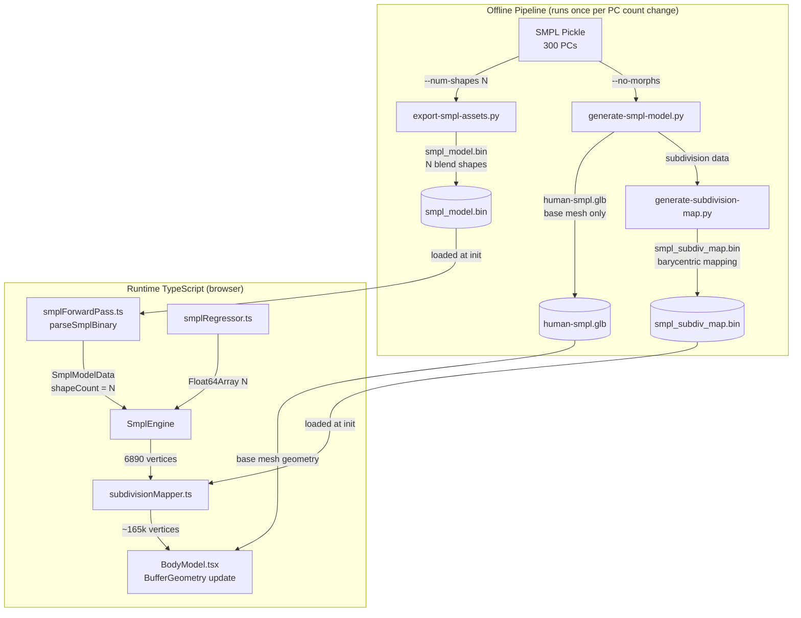
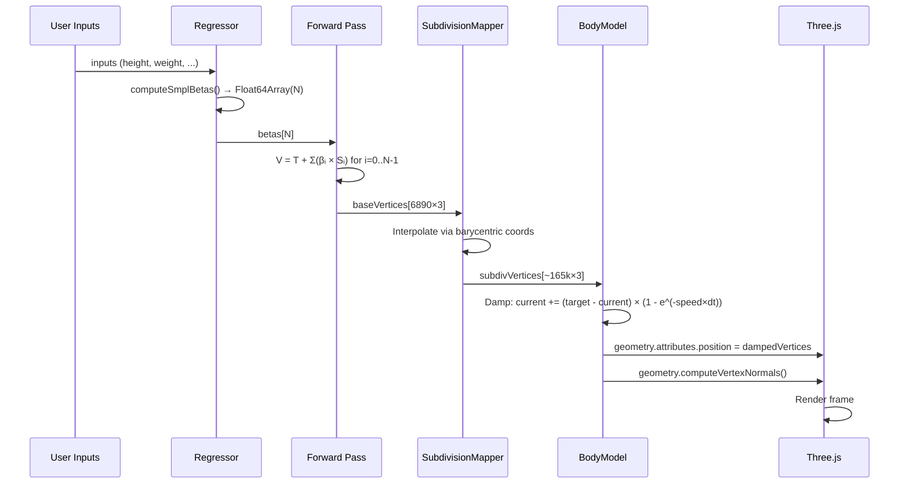
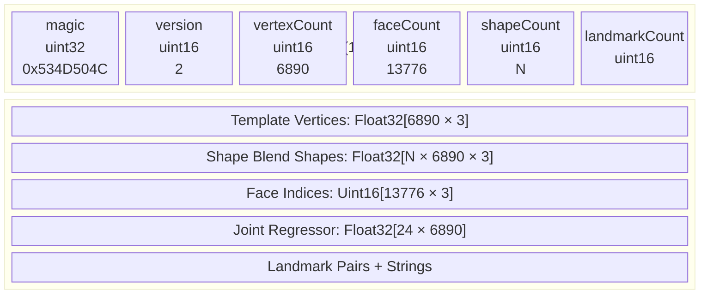
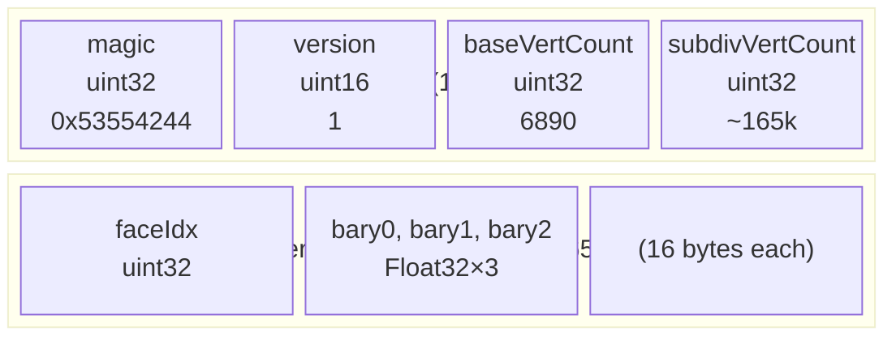

# Design Document: Expanded Beta PCs

## Overview

This design extends the SMPL body model pipeline from a hardcoded 10 principal components (PCs) to a configurable N PCs (10–50). The critical architectural change is eliminating the GLB morph target dependency for SMPL shape: instead of encoding shape variations as GLB shape keys (which would produce a 470 MB file for 50 PCs), the system computes vertex positions entirely via the binary forward pass and updates Three.js geometry buffers directly.

The implementation has four phases:

1. **Binary pipeline** (Python scripts): Export N blend shapes to `smpl_model.bin`, generate a morph-free GLB, and produce a subdivision mapping asset.
2. **Forward pass generalization** (TypeScript): Make `parseSmplBinary()` and `computeSmplVertices()` work with any shapeCount from the binary header.
3. **Rendering pipeline** (React/Three.js): Replace morph target animation with direct buffer geometry updates using the subdivision mapping.
4. **Regressor and training** (TypeScript + Python): Extend beta output to N, zero-padding beyond trained range; extend training scripts to support N betas.

### Key Design Decisions

- **Binary forward pass over GLB morph targets**: The SMPL binary at 50 PCs is ~8 MB (manageable). The GLB with 100 morph targets at 165k vertices would be ~470 MB (unacceptable). Computing vertices in JS and updating buffers directly eliminates the file size problem entirely.
- **Subdivision mapping asset over runtime subdivision**: Subdividing 6,890 vertices to ~165k at runtime would require a subdivision algorithm in JS. Instead, we precompute the mapping once in Blender/Python and load it as a compact binary asset (~3 MB). This is a one-time cost.
- **Barycentric interpolation over nearest-vertex**: Barycentric coordinates on the base mesh triangles produce smooth interpolated positions on the subdivided mesh, matching the quality of Catmull-Clark subdivision. Nearest-vertex would produce visible artifacts at triangle boundaries.
- **shapeCount in binary header over separate config file**: The binary already has a header with a `shapeCount` field (currently hardcoded to 10). Making the forward pass read this field means the binary is self-describing — no external config needed.
- **Zero-padding regressor output over training all N betas immediately**: The regressor currently has calibrated weights for 10 betas. Extending to N by zero-padding betas 10+ is safe (those PCs contribute nothing) and allows incremental improvement: train 10 first, add more as calibration data becomes available.
- **Damped buffer updates over instant snapping**: The current morph target animation uses exponential damping for smooth transitions. The buffer update path must replicate this by interpolating between current and target vertex positions each frame.

## Architecture



### Data Flow: Frame Update Cycle



### Binary Format: smpl_model.bin (Extended)



### Subdivision Mapping: smpl_subdiv_map.bin



## Components and Interfaces

### 1. Extended `smplForwardPass.ts`

**Changes to `SmplModelData` interface:**

```typescript
export interface SmplModelData {
  templateVertices: Float32Array;   // 6890 × 3
  shapeBlendShapes: Float32Array;   // shapeCount × 6890 × 3
  faceIndices: Uint16Array;         // 13776 × 3
  jointRegressor: Float32Array;     // 24 × 6890
  landmarkVertexIndices: Map<string, number>;
  shapeCount: number;               // NEW: actual PC count from header
}
```

**Changes to `parseSmplBinary()`:**
- Read `shapeCount` from header (bytes 10–11) without validating against a hardcoded constant
- Validate `shapeCount` is in range [1, 300]
- Allocate `shapeBlendShapes` as `Float32Array(shapeCount × vertexCount × 3)`
- Store `shapeCount` on the returned `SmplModelData`

**Changes to `computeSmplVertices()`:**
```typescript
export function computeSmplVertices(
  model: SmplModelData,
  betas: Float64Array,
  outputVertices: Float32Array,
): void {
  const vertCount = SMPL_VERTEX_COUNT;
  const floatCount = vertCount * 3;
  outputVertices.set(model.templateVertices);

  // Use min(betas.length, model.shapeCount) — handles mismatched sizes
  const numShapes = Math.min(betas.length, model.shapeCount);
  const shapes = model.shapeBlendShapes;
  for (let i = 0; i < numShapes; i++) {
    const beta = betas[i];
    if (beta === 0) continue;
    const shapeOffset = i * floatCount;
    for (let j = 0; j < floatCount; j++) {
      outputVertices[j] += beta * shapes[shapeOffset + j];
    }
  }
}
```

**Changes to `validateHeader()`:**
- Remove the assertion `header.shapeCount !== SMPL_SHAPE_COUNT`
- Add range check: `if (header.shapeCount < 1 || header.shapeCount > 300) throw ...`
- Bump `SMPL_VERSION` constant to 2 (accept both 1 and 2)

### 2. New `subdivisionMapper.ts`

New module that loads the precomputed subdivision mapping and interpolates base mesh vertices onto the subdivided mesh.

```typescript
/** Subdivision mapping data loaded from binary asset */
export interface SubdivisionMap {
  baseVertCount: number;      // 6890
  subdivVertCount: number;    // ~165,000
  faceIndices: Uint32Array;   // [subdivVertCount] — which base face
  baryCoords: Float32Array;   // [subdivVertCount × 3] — barycentric weights
}

/** Parse the subdivision mapping binary */
export function parseSubdivisionMap(buffer: ArrayBuffer): SubdivisionMap;

/** Load subdivision mapping from URL */
export async function loadSubdivisionMap(url: string): Promise<SubdivisionMap | null>;

/**
 * Interpolate base mesh vertices onto subdivided mesh.
 *
 * For each subdivided vertex:
 *   P_subdiv = bary0 × V[face[0]] + bary1 × V[face[1]] + bary2 × V[face[2]]
 *
 * where face[0..2] are the three vertex indices of the base mesh triangle,
 * and bary0..2 are the barycentric coordinates.
 *
 * @param baseVertices - 6890×3 Float32Array from forward pass
 * @param baseFaces - 13776×3 Uint16Array face indices
 * @param map - Precomputed subdivision mapping
 * @param output - Pre-allocated Float32Array of length subdivVertCount×3
 */
export function interpolateSubdivision(
  baseVertices: Float32Array,
  baseFaces: Uint16Array,
  map: SubdivisionMap,
  output: Float32Array,
): void;
```

**Binary format for `smpl_subdiv_map.bin`:**
```
Header (16 bytes):
  magic:          uint32 — 0x53554244 ("SUBD")
  version:        uint16 — 1
  reserved:       uint16 — 0
  baseVertCount:  uint32 — 6890
  subdivVertCount: uint32 — ~165,000

Per-vertex data (subdivVertCount × 16 bytes):
  faceIdx:  uint32    — index into base mesh face array
  bary0:    float32   — barycentric weight for vertex 0 of face
  bary1:    float32   — barycentric weight for vertex 1 of face
  bary2:    float32   — barycentric weight for vertex 2 of face
```

**Estimated file size:** ~165,000 × 16 bytes = ~2.6 MB

### 3. New `scripts/generate-subdivision-map.py`

Python/Blender script that generates the subdivision mapping asset.

**Process:**
1. Load the SMPL base mesh (6,890 vertices, 13,776 faces)
2. Apply Catmull-Clark subdivision (2 levels) to get the subdivided mesh (~165k vertices)
3. For each subdivided vertex, find which base mesh triangle it lies on and compute barycentric coordinates
4. Export as `smpl_subdiv_map.bin`

**Approach for barycentric computation:**
- After subdivision, each subdivided vertex is a weighted combination of base mesh vertices
- Blender's subdivision surface modifier preserves this relationship
- For each subdivided vertex, project onto the nearest base mesh face and compute barycentric coordinates using the face's three vertices

### 4. Modified `export-smpl-assets.py`

**Changes:**
- `EXPECTED_SHAPE_COUNT` becomes a CLI parameter, not a constant
- `--num-shapes` argument (default 10, range 10–50)
- `export_smpl_model_bin()` writes `shapeCount = N` in header
- `shapes_N = shapedirs[:, :, :N]` instead of `shapedirs[:, :, :10]`
- `validate_smpl_data()` checks `shapedirs.shape[2] >= N` instead of `>= 10`
- Binary version bumped to 2

### 5. Modified `generate-smpl-model.py`

**Changes:**
- Add `--no-morphs` flag
- When `--no-morphs` is set:
  - Skip the shape key computation loop entirely (steps 3 and 4)
  - Export GLB with `export_morph=False`
  - Still apply A-pose, subdivision, UV unwrap, texture, smooth shading
- Retain existing `--num-shapes` behavior when `--no-morphs` is not set

### 6. Modified `smplRegressor.ts`

**Changes to support N-length beta output:**

```typescript
/** Module-level: the active model's shape count */
let activeShapeCount: number = 10;

/** Set the active shape count (called when SMPL model is loaded) */
export function setActiveShapeCount(n: number): void {
  activeShapeCount = n;
}

/** Get the active shape count */
export function getActiveShapeCount(): number {
  return activeShapeCount;
}
```

**Modified `lookupRegress()`:**
```typescript
export function lookupRegress(inputs: RegressorInputs): Float64Array {
  const N = activeShapeCount;
  
  // Compute base 10 betas (or however many the regression covers)
  const baseBetas = /* existing regression logic producing 10 betas */;
  
  // Extend to N
  const betas = new Float64Array(N);
  betas.set(baseBetas); // copies first 10, rest are 0.0
  return betas;
}
```

**Modified preset/composition vectors:**
```typescript
function extendVector(vec: Float64Array, targetLength: number): Float64Array {
  if (vec.length >= targetLength) return vec;
  const extended = new Float64Array(targetLength);
  extended.set(vec);
  return extended;
}
```

`applyPresetOffsets()` and `applyCompositionBias()` use `extendVector()` to match the betas array length. Values beyond the original 10 remain 0.0.

### 7. Modified `bodyEngine.ts`

**Changes to `SmplEngine`:**
```typescript
export class SmplEngine implements BodyEngine {
  private model: SmplModelData;
  private vertices: Float32Array;       // 6890×3 base vertices
  private normals: Float32Array;        // 6890×3 base normals
  private betas: Float64Array;          // N-length

  constructor(model: SmplModelData, regressor: SmplRegressorFn) {
    this.model = model;
    this.vertices = new Float32Array(SMPL_VERTEX_COUNT * 3);
    this.normals = new Float32Array(SMPL_VERTEX_COUNT * 3);
    this.betas = new Float64Array(model.shapeCount); // N, not 10

    // Set the active shape count for the regressor
    setActiveShapeCount(model.shapeCount);
    
    // Initialize with template mesh
    this.vertices.set(model.templateVertices);
    computeSmplNormals(this.vertices, model.faceIndices, this.normals);
  }
  // ... rest unchanged, update() produces N-length betas
}
```

### 8. Modified `BodyModel.tsx`

**Major refactor: replace morph target animation with buffer geometry updates.**

```typescript
// New refs for buffer update path
const targetVerticesRef = useRef<Float32Array | null>(null);
const currentVerticesRef = useRef<Float32Array | null>(null);
const subdivMapRef = useRef<SubdivisionMap | null>(null);

// Load subdivision map on mount
useEffect(() => {
  loadSubdivisionMap('/models/smpl/smpl_subdiv_map.bin').then(map => {
    subdivMapRef.current = map;
  }).catch(() => {
    console.warn('[BodyModel] Subdivision map not available, using base mesh');
  });
}, []);
```

**SMPL rendering path (replaces morph target driving):**
```typescript
// In the useEffect that responds to input changes:
if (bodyEngineType === 'smpl-refined' && bodyEngine instanceof SmplEngine) {
  // Get base vertices from engine (6890×3)
  const baseVerts = bodyEngine.getVertexPositions();
  
  if (subdivMapRef.current && meshRef.current) {
    // Interpolate to subdivided mesh
    if (!targetVerticesRef.current) {
      targetVerticesRef.current = new Float32Array(subdivMapRef.current.subdivVertCount * 3);
      currentVerticesRef.current = new Float32Array(subdivMapRef.current.subdivVertCount * 3);
    }
    interpolateSubdivision(
      baseVerts,
      bodyEngine.getFaces() as Uint16Array,
      subdivMapRef.current,
      targetVerticesRef.current,
    );
  }
}
```

**In `useFrame` — damped buffer update:**
```typescript
useFrame((_, delta) => {
  const mesh = meshRef.current;
  if (!mesh) return;
  const dt = Math.min(delta, 0.05);

  if (bodyEngineType === 'smpl-refined' && targetVerticesRef.current && currentVerticesRef.current) {
    // Damp vertex positions
    const cur = currentVerticesRef.current;
    const tgt = targetVerticesRef.current;
    const factor = 1 - Math.exp(-SMOOTH * dt);
    for (let i = 0; i < cur.length; i++) {
      cur[i] += (tgt[i] - cur[i]) * factor;
    }
    
    // Write to geometry buffer
    const posAttr = mesh.geometry.attributes.position;
    (posAttr.array as Float32Array).set(cur);
    posAttr.needsUpdate = true;
    mesh.geometry.computeVertexNormals();
  }
  
  // ... existing height/width scaling and MakeHuman morph target code
});
```

### 9. Modified `train-beta-coefficients.py`

**Changes:**
- Add `--num-betas` CLI argument (default 10)
- `NUM_BETAS = args.num_betas`
- Validate against calibration dataset beta length
- Export `regression.weights` as `[N][7]`, `regression.intercepts` as `[N]`
- Add `numBetas` field to output JSON
- Preset offsets, composition bias, sensitivity map, fat distribution all computed for N betas

### 10. Modified `generate-shapy-data.py`

**Changes:**
- Add `--num-betas` CLI argument (default 10)
- Pass `num_betas` to SHAPY A2S model invocation
- Store full-length betas in output dataset
- Add `numBetas` field to each entry

## Data Models

### Extended SmplModelData

```typescript
export interface SmplModelData {
  templateVertices: Float32Array;   // 6890 × 3
  shapeBlendShapes: Float32Array;   // shapeCount × 6890 × 3
  faceIndices: Uint16Array;         // 13776 × 3
  jointRegressor: Float32Array;     // 24 × 6890
  landmarkVertexIndices: Map<string, number>;
  shapeCount: number;               // N (from header)
}
```

### SubdivisionMap

```typescript
export interface SubdivisionMap {
  baseVertCount: number;
  subdivVertCount: number;
  faceIndices: Uint32Array;    // [subdivVertCount]
  baryCoords: Float32Array;    // [subdivVertCount × 3]
}
```

### Extended CalibratedCoefficients

```typescript
export interface CalibratedCoefficients {
  version: string;
  generatedAt: string;
  numBetas: number;                   // NEW: how many betas the regression covers

  regression: {
    intercepts: number[];             // [numBetas]
    weights: number[][];              // [numBetas][7]
    features: string[];
    normalization: Record<string, { center: number; range: number }>;
  };

  regression8?: { /* same structure, [numBetas][11] */ };

  presetOffsets: Record<string, number[]>;     // each array length numBetas
  compositionBias: Record<string, number[]>;   // each array length numBetas
  sensitivityMap: Record<string, Array<{ betaIdx: number; sensitivity: number }>>;
  fatDistribution: Record<string, { weightToBeta: number[]; ageFactor: number[] }>;
}
```

### File Size Estimates

| PC Count | Binary Size | GLB (no morphs) | Subdiv Map | Total Load |
|----------|-------------|------------------|------------|------------|
| 10       | 1.6 MB      | ~12 MB           | 2.6 MB     | ~16 MB     |
| 20       | 3.2 MB      | ~12 MB           | 2.6 MB     | ~18 MB     |
| 50       | 8.0 MB      | ~12 MB           | 2.6 MB     | ~23 MB     |

All well within acceptable web app limits, especially with gzip compression (~60% reduction).

## Correctness Properties

### Property 1: Binary Parse Round-Trip — shapeCount Preserved (Round-Trip)
- **Requirements**: 1.2, 2.1, 3.1
- **Type**: Round-trip
- **Property**: For all N in [1, 300], constructing a synthetic SMPL binary with `shapeCount = N` and parsing it via `parseSmplBinary()` produces a `SmplModelData` where `model.shapeCount === N` and `model.shapeBlendShapes.length === N × 6890 × 3`.
- **Testable**: yes — property-based test generating synthetic binaries with random shapeCount values.

### Property 2: Forward Pass Uses min(betas, shapeCount) Shapes (Invariant)
- **Requirements**: 3.2, 3.5, 3.6
- **Type**: Invariant
- **Property**: For all shapeCount N in [1, 50] and betas length M in [1, 50], `computeSmplVertices()` with an N-PC model and M-length betas produces the same output as manually computing `T + Σ(βᵢ × Sᵢ)` for `i = 0..min(N,M)-1`. Specifically, when M < N, only the first M blend shapes contribute; when M > N, betas beyond N are ignored.
- **Testable**: yes — property-based test with synthetic model data and random betas.

### Property 3: Backward Compatibility — 10-PC Identity (Invariant)
- **Requirements**: 10.1, 10.2
- **Type**: Invariant
- **Property**: For all valid 10-element beta vectors, `computeSmplVertices()` with a 10-PC model produces vertex positions identical (within Float32 precision, < 1e-6) to the current hardcoded implementation. The generalized code path does not alter results for the 10-PC case.
- **Testable**: yes — property-based test comparing new vs old implementation with random 10-element betas.

### Property 4: Regressor Output Length Matches Model (Invariant)
- **Requirements**: 4.1, 4.3
- **Type**: Invariant
- **Property**: For all valid `RegressorInputs` and any `activeShapeCount` N in [10, 50], `computeSmplBetas()` returns a `Float64Array` of length exactly N, where every element is finite and in [-3, 3].
- **Testable**: yes — property-based test with random inputs and varying activeShapeCount.

### Property 5: Regressor Zero-Pads Beyond Trained Range (Invariant)
- **Requirements**: 4.2, 10.3
- **Type**: Invariant
- **Property**: When the calibrated regression covers K betas (e.g., K=10) and `activeShapeCount` is N > K, the returned betas at indices K through N-1 are exactly 0.0 before preset/composition offsets are applied. After offsets (which are also zero-padded), betas K..N-1 remain 0.0.
- **Testable**: yes — property-based test verifying zero values at indices beyond trained range.

### Property 6: Subdivision Interpolation Preserves Base Vertices (Invariant)
- **Requirements**: 7.1, 7.3
- **Type**: Invariant
- **Property**: For all valid base mesh vertex positions, `interpolateSubdivision()` produces output positions where the sum of barycentric weights for each subdivided vertex equals 1.0 (within 1e-5), and all output vertex coordinates are finite numbers.
- **Testable**: yes — property-based test with random base vertex positions and a fixed subdivision map.

### Property 7: Binary Size Scales Linearly with shapeCount (Metamorphic)
- **Requirements**: 2.5, 11.4
- **Type**: Metamorphic
- **Property**: For all N₁ < N₂ in [10, 50], the binary size for N₂ PCs exceeds the binary size for N₁ PCs by approximately `(N₂ - N₁) × 6890 × 3 × 4` bytes (±header overhead). The 50-PC binary is less than 10 MB.
- **Testable**: yes — property-based test computing expected sizes for random N values.

### Property 8: validateHeader Accepts Range [1, 300] (Invariant)
- **Requirements**: 3.4
- **Type**: Invariant
- **Property**: For all shapeCount values in [1, 300], `validateHeader()` does not throw. For shapeCount = 0 or shapeCount > 300, `validateHeader()` throws an error.
- **Testable**: yes — property-based test with random shapeCount values inside and outside the valid range.

### Property 9: Forward Pass Performance with 50 PCs (Example)
- **Requirements**: 11.1
- **Type**: Example-based (benchmark)
- **Property**: `computeSmplVertices()` with a 50-PC synthetic model and 50-element betas completes in less than 5 milliseconds averaged over 100 iterations.
- **Testable**: yes — example-based benchmark test.

### Property 10: Preset/Composition Extension Preserves First 10 Values (Invariant)
- **Requirements**: 4.4, 4.5
- **Type**: Invariant
- **Property**: For all body types and compositions, extending the preset offset or composition bias vector from length 10 to length N preserves the original 10 values exactly, and all values at indices 10..N-1 are 0.0.
- **Testable**: yes — property-based test comparing extended vectors with originals.
