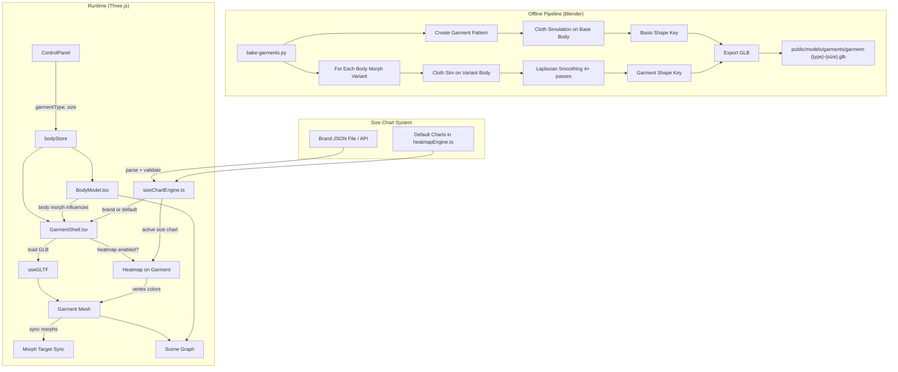

# Garment Shell Phase 2 — Design Document

## Overview

This feature adds 3D garment shell meshes that sit on top of the body avatar as separate Three.js scene objects. Garment shapes are pre-baked in Blender using cloth simulation against multiple body shape variants, exported as GLB files with morph targets that mirror the body's morph targets. At runtime, the garment loader syncs garment morph influences with body morph influences so the clothing deforms to match the user's body shape. Heatmap fit colors transfer from the body skin to the garment shell surface, and a pluggable brand size chart system allows external brands to override the default measurements.

The system spans two domains:

1. **Offline pipeline** (Blender Python scripts): Create parametric garment patterns → run cloth simulation → bake morph targets per body variant → export GLB files to `public/models/garments/`.
2. **Runtime** (TypeScript/Three.js): Load garment GLBs → sync morph targets with body → apply heatmap vertex colors to garment mesh → render semi-transparent fabric material on top of body.

### Design Rationale

- **Pre-baked cloth sim over real-time physics**: Blender's cloth solver produces realistic drape offline. Runtime cost is zero — just morph target blending, which Three.js already handles for the body. This keeps the app fully client-side with no server dependency.
- **Morph target mirroring**: By naming garment morph targets identically to body morph targets (Heavier, WiderShoulders, etc.), the runtime can apply the same influence values to both meshes with no mapping logic.
- **Separate scene object over merged geometry**: Garment as a child of the body group means independent material control (semi-transparent fabric), easy swap on garment/size change, and clean separation from the body's skin material pipeline.
- **Brand size chart as JSON**: A typed JSON schema lets brands provide measurements without code changes. Validation at parse time catches errors early. Fallback to the existing default charts preserves backward compatibility.

## Architecture



### Data Flow

1. User selects garment type + size in `ControlPanel` → stored in `bodyStore`.
2. `GarmentShell.tsx` reacts to store changes, loads the corresponding `garment-{type}-{size}.glb` via `useGLTF`.
3. `GarmentShell.tsx` reads the current body morph influences from `BodyModel.tsx` (shared via store or ref) and applies matching influences to garment morph targets.
4. When body inputs change, `inputsToMorphs()` recalculates body morph influences → `GarmentShell.tsx` animates garment morphs to match (same `damp()` function, same speed).
5. When heatmap is enabled, `GarmentShell.tsx` runs `computeHeatmap()` against garment vertex positions (normalized height, distance from center) and applies vertex colors + Laplacian smoothing to the garment mesh. The body mesh reverts to skin-only rendering.
6. When heatmap is disabled, garment displays neutral fabric color.

### File Structure (New Files)

```
scripts/
  bake-garments.py          # Blender pipeline: pattern → sim → morph targets → GLB export
public/models/garments/
  garment-tee-M.glb         # Example output (one per type-size combo)
  garment-oxford-M.glb
  garment-slim-jeans-32.glb
  garment-straight-jeans-32.glb
  ...
src/
  components/
    GarmentShell.tsx         # Three.js garment loader, morph sync, heatmap on garment
  utils/
    sizeChartEngine.ts       # Brand size chart parsing, validation, serialization
  data/
    defaultSizeCharts.ts     # Extracted default size chart data (from heatmapEngine.ts)
```

## Components and Interfaces

### 1. `bake-garments.py` — Blender Pipeline Script

**Purpose**: Create garment pattern meshes, run cloth simulation, generate morph targets for body shape variants, export GLB files.

**CLI**:
```bash
& "C:\Program Files\Blender Foundation\Blender 5.1\blender.exe" --background --python scripts/bake-garments.py -- --types tee,oxford,slim-jeans,straight-jeans --sizes M,L --body public/models/male-base.fbx --out public/models/garments/
```

**Parameters**:
- `--types`: Comma-separated garment types (default: all four)
- `--sizes`: Comma-separated sizes (default: all sizes in chart)
- `--body`: Path to body FBX (default: `public/models/male-base.fbx`)
- `--out`: Output directory (default: `public/models/garments/`)

**Internal flow per garment-size combination**:

1. Import body FBX, apply -90° X rotation (same as `generate-morphs.py`)
2. Create parametric garment pattern mesh:
   - **Tee**: Tubular torso (chest circumference from size chart) + short sleeve cylinders, round neckline cutout, hem at normalized height 0.44
   - **Oxford**: Tubular torso + long sleeve cylinders to wrist, collar neckline, hem at 0.44
   - **Slim Jeans**: Two tapered leg tubes joined at waist with waistband, hip-to-narrow-ankle taper
   - **Straight Jeans**: Two leg tubes joined at waist, consistent width knee-to-ankle
3. Position pattern mesh 0.005m offset from body surface
4. Pin anchor vertices (shoulder seams for tops, waistband for jeans)
5. Configure cloth physics: cotton weight 0.3 kg/m², structural stiffness 15–40, bending stiffness 0.5–5.0
6. Set body mesh as collision object
7. Run cloth simulation (~100 frames), bake final frame as basis shape key
8. Verify no interpenetration; push violating vertices outward along body normal
9. For each body morph variant (Heavier, Thinner, WiderShoulders, WiderHips, BiggerChest, BiggerStomach, ThickerThighs, ThickerCalves at 100%):
   - Apply morph to body mesh
   - Re-run cloth simulation
   - Store result as garment shape key with same name
   - Apply 4-pass Laplacian smoothing to displacement
   - Reset body morph
10. Export GLB: morph targets enabled, morph normals disabled, Y-up, same orientation as body model

**Garment pattern dimensions** are derived from the size chart measurements:
- Torso circumference → cylinder radius = chest_cm / (2π × 100)
- Sleeve length derived from shoulder width + arm length estimate
- Leg length from inseam measurement
- All dimensions in Blender meters (cm / 100)

### 2. `GarmentShell.tsx` — Runtime Garment Component

**Purpose**: Load garment GLB, sync morph targets with body, apply heatmap, render semi-transparent fabric.

```typescript
interface GarmentShellProps {
  bodyMorphInfluences: Record<string, number>;
  bodyHeightScale: number;
  bodyWidthScale: number;
}

export function GarmentShell({ bodyMorphInfluences, bodyHeightScale, bodyWidthScale }: GarmentShellProps)
```

**Key behaviors**:
- Loads `garment-{type}-{size}.glb` via `useGLTF` with `Suspense` fallback
- On load, reads garment mesh's `morphTargetDictionary` and maps names to body morph names
- Each frame: `damp()` garment morph influences toward body morph influences (same SMOOTH=10 constant)
- Scales garment group to match body group scale (height × width compensation)
- When heatmap enabled: computes vertex colors using `computeHeatmap()` on garment vertex positions, applies Laplacian smoothing via `smoothColors()`, sets `vertexColors: true` on material
- When heatmap disabled: uses neutral `MeshPhysicalMaterial` (light gray, opacity 0.75)
- On garment/size change: disposes previous GLB resources, loads new one
- On load failure: logs warning, renders nothing (body still visible)

**Material configuration**:
```typescript
new THREE.MeshPhysicalMaterial({
  color: 0xdddddd,          // neutral light gray
  opacity: 0.75,
  transparent: true,
  side: THREE.DoubleSide,
  roughness: 0.8,
  depthWrite: false,
  // renderOrder set higher than body mesh
})
```

### 3. `sizeChartEngine.ts` — Brand Size Chart System

**Purpose**: Parse, validate, and serialize brand size chart JSON. Provide active size chart to heatmap engine.

```typescript
/** Brand size chart JSON schema */
export interface BrandSizeChart {
  brand: string;
  garmentType: GarmentType;
  sizes: Record<string, SizeMeasurements>;
}

export interface SizeMeasurements {
  chest?: number;
  waist?: number;
  hip?: number;
  shoulder?: number;
  neck?: number;
  bicep?: number;
  thigh?: number;
  calf?: number;
  inseam?: number;
  wrist?: number;
}

/** Required measurements per garment type */
const REQUIRED_MEASUREMENTS: Record<string, string[]> = {
  tee:             ['chest', 'waist', 'shoulder'],
  oxford:          ['chest', 'waist', 'shoulder', 'neck'],
  'slim-jeans':    ['waist', 'hip', 'thigh', 'inseam'],
  'straight-jeans':['waist', 'hip', 'thigh', 'inseam'],
};

/** Parse a JSON string into a BrandSizeChart. Throws on invalid data. */
export function parseBrandSizeChart(json: string): BrandSizeChart;

/** Validate a BrandSizeChart object. Returns error messages or empty array. */
export function validateBrandSizeChart(chart: BrandSizeChart): string[];

/** Serialize a BrandSizeChart to JSON string. */
export function stringifyBrandSizeChart(chart: BrandSizeChart): string;

/** Get the active size chart for a garment type (brand override or default). */
export function getActiveSizeChart(
  garmentType: GarmentType,
  brandChart?: BrandSizeChart | null,
): Record<string, Record<string, number>>;
```

**Validation rules**:
- `brand` must be a non-empty string
- `garmentType` must be one of the four known types
- `sizes` must have at least one size entry
- Each size must have all required measurements for its garment type
- All measurement values must be positive finite numbers

### 4. `bodyStore.ts` — Store Extensions

**New state fields**:
```typescript
interface BodyStore {
  // ... existing fields ...
  brandSizeChart: BrandSizeChart | null;
  setBrandSizeChart: (chart: BrandSizeChart | null) => void;
  
  // Shared morph influences (computed by BodyModel, read by GarmentShell)
  currentMorphInfluences: Record<string, number>;
  setCurrentMorphInfluences: (influences: Record<string, number>) => void;
}
```

### 5. `BodyModel.tsx` — Modifications

**Changes**:
- When heatmap is enabled AND a garment shell is loaded: render body with skin texture only (no vertex colors). The heatmap moves to the garment.
- Expose current morph influences to store so `GarmentShell.tsx` can read them.
- No changes to morph target animation, height/width scaling, or mesh processing.

### 6. `Scene.tsx` — Modifications

**Changes**:
- Add `<GarmentShell />` as sibling to `<BodyModel />` inside the `<Suspense>` boundary.
- Pass body morph influences and scale factors via store (already reactive).

### 7. `heatmapEngine.ts` — Modifications

**Changes**:
- `computeHeatmap()` accepts an optional `sizeChartOverride` parameter for brand size charts.
- When `sizeChartOverride` is provided, use those measurements instead of the built-in `garments[type].sizes[size]`.
- The `getVertexFit()` function remains unchanged — it works on normalized vertex positions regardless of whether they come from body or garment mesh.

```typescript
export function computeHeatmap(
  garmentType: GarmentType,
  size: string,
  fitPref: FitPreference,
  bodyMeasurements: BodyMeasurementsInput,
  sizeChartOverride?: Record<string, number> | null,
): HeatmapResult | null;
```

## Data Models

### Garment GLB File Structure

Each garment GLB contains:
- **Single mesh** with garment geometry (~5k–20k vertices depending on garment complexity)
- **Basis shape key**: Garment draped on base body (175cm, 75kg average male)
- **8 morph targets** (matching body morph subset):
  - `Heavier`, `Thinner`, `WiderShoulders`, `WiderHips`
  - `BiggerChest`, `BiggerStomach`, `ThickerThighs`, `ThickerCalves`
- **No morph normals** (disabled to reduce file size)
- **No skeleton/armature** (garment is a static mesh with shape keys)
- **No textures** (vertex colors applied at runtime for heatmap; neutral color for non-heatmap)

**Naming convention**: `garment-{type}-{size}.glb`
- `garment-tee-M.glb`, `garment-tee-L.glb`, ...
- `garment-oxford-S.glb`, `garment-oxford-M.glb`, ...
- `garment-slim-jeans-32.glb`, `garment-slim-jeans-34.glb`, ...
- `garment-straight-jeans-30.glb`, ...

### Brand Size Chart JSON Schema

```json
{
  "brand": "Uniqlo",
  "garmentType": "tee",
  "sizes": {
    "XS": { "chest": 88, "waist": 84, "shoulder": 41, "neck": 36, "bicep": 29 },
    "S":  { "chest": 94, "waist": 90, "shoulder": 43, "neck": 37, "bicep": 31 },
    "M":  { "chest": 100, "waist": 96, "shoulder": 45, "neck": 38, "bicep": 33 },
    "L":  { "chest": 106, "waist": 102, "shoulder": 47, "neck": 39, "bicep": 35 },
    "XL": { "chest": 114, "waist": 110, "shoulder": 49, "neck": 41, "bicep": 37 }
  }
}
```

### Garment Pattern Dimensions (Blender)

| Garment | Base Shape | Key Dimensions | Anchor Points |
|---------|-----------|----------------|---------------|
| Tee | Tubular torso + short sleeve cylinders | chest circumference, shoulder width, sleeve length ~15cm from shoulder | Shoulder seam vertices |
| Oxford | Tubular torso + long sleeve cylinders | chest circumference, shoulder width, sleeve to wrist | Shoulder seam vertices |
| Slim Jeans | Two tapered leg tubes + waistband | waist, hip, thigh (tapers to narrow ankle) | Waistband top edge |
| Straight Jeans | Two straight leg tubes + waistband | waist, hip, thigh (consistent width knee→ankle) | Waistband top edge |

### Coordinate System Alignment

Garment GLBs use identical coordinate conventions to `human-male.glb`:
- **Y-up** (GLB standard)
- **Z-negative = front** (belly), **Z-positive = back**
- **Origin**: centered on X/Z, feet at Y=0
- **Blender export**: Same -90° X rotation fix + `export_yup=True` as `generate-morphs.py`

### Morph Target Influence Sync

```
Body morph influence (from inputsToMorphs) → bodyStore.currentMorphInfluences
  ↓
GarmentShell reads influences → applies to garment morph targets with same names
  ↓
Both animate via damp() at SMOOTH=10 → visually synchronized deformation
```

Only the 8 body-relevant morphs are mirrored to garments. Fat deposit morphs (BellyPouch, LoveHandles, etc.) and extremity morphs (LongerLegs, LongerArms, etc.) are not simulated on garments — their effect on garment shape is negligible or handled by the primary morphs.


## Correctness Properties

*A property is a characteristic or behavior that should hold true across all valid executions of a system — essentially, a formal statement about what the system should do. Properties serve as the bridge between human-readable specifications and machine-verifiable correctness guarantees.*

**PBT Applicability Assessment**: This feature spans two domains. The Blender pipeline (Requirements 1–3, 8, 10) is offline script execution — not suitable for PBT. The Three.js rendering components (Requirements 4–6) are tightly coupled to the WebGL runtime — not suitable for PBT. However, the size chart system (Requirements 7, 9) contains pure functions with clear input/output behavior that are ideal for property-based testing: validation logic and serialization round-trips.

### Property 1: Size chart validation correctness

*For any* `BrandSizeChart` object, `validateBrandSizeChart()` SHALL return an empty error array if and only if: the `brand` field is a non-empty string, the `garmentType` is one of the four known types, `sizes` has at least one entry, every size entry contains all required measurements for its garment type, and all measurement values are positive finite numbers. For any object that violates one or more of these conditions, validation SHALL return a non-empty array of descriptive error strings.

**Validates: Requirements 7.2, 7.6**

### Property 2: Size chart serialization round-trip

*For any* valid `BrandSizeChart` object (one that passes validation), `parseBrandSizeChart(stringifyBrandSizeChart(chart))` SHALL produce an object that is deeply equal to the original chart. Equivalently, serializing and then parsing preserves all data.

**Validates: Requirements 9.3, 9.4**

## Error Handling

### Blender Pipeline Errors

| Error Condition | Handling |
|----------------|----------|
| Body FBX not found at path | Script exits with `RuntimeError` and descriptive message |
| No mesh found in FBX | Script exits with `RuntimeError` (same pattern as `generate-morphs.py`) |
| Cloth simulation produces interpenetration | Push vertices outward along body normal by minimum offset distance (0.003m) |
| Cloth simulation fails to converge | Log warning, skip this garment-size combination, continue with next |
| Output directory doesn't exist | Create it (`os.makedirs(out_dir, exist_ok=True)`) |
| Single garment-size exceeds 5-minute timeout | Log warning with timing info, continue (no hard abort) |

### Runtime Errors

| Error Condition | Handling |
|----------------|----------|
| Garment GLB fails to load (404, network error, corrupt file) | `console.warn()` with garment type/size info, render body without garment shell. No user-facing error. |
| Garment GLB has no morph targets | Load mesh without morph sync. Garment will display in base shape only. Log warning. |
| Garment morph target name doesn't match any body morph | Skip that morph target (influence stays at 0). Log debug info. |
| Brand size chart JSON is malformed | `parseBrandSizeChart()` throws with descriptive message. Caller catches and falls back to default chart. |
| Brand size chart fails validation | `validateBrandSizeChart()` returns error array. Caller logs errors and falls back to default chart. |
| Heatmap computation returns null (unknown garment type) | Garment displays neutral material without vertex colors. |

### Graceful Degradation Strategy

The system degrades gracefully at each layer:
1. **No garment GLB available** → Body renders normally with heatmap on skin (Phase 1 behavior)
2. **Garment loads but no morph targets** → Garment displays in base shape, heatmap still works
3. **Brand chart invalid** → Falls back to default chart, logs error
4. **Heatmap disabled** → Garment shows neutral fabric color

## Testing Strategy

### Dual Testing Approach

- **Property-based tests** (fast-check): Validate universal properties of the size chart system (validation correctness, serialization round-trips)
- **Unit tests** (Vitest): Verify specific examples, edge cases, and structural checks for the size chart system
- **Integration tests**: Manual verification of Blender pipeline output and Three.js rendering
- **Visual tests**: Manual inspection of garment appearance, morph sync, heatmap transfer

### Property-Based Tests

Library: [fast-check](https://github.com/dubzzz/fast-check) (already in devDependencies)
Framework: Vitest (already configured)
Minimum iterations: 100 per property test

| Property | Test File | Generator Strategy |
|----------|-----------|-------------------|
| 1: Validation correctness | `src/utils/__tests__/sizeChartEngine.test.ts` | Generate random `BrandSizeChart` objects — mix of valid (all fields correct) and invalid (missing fields, negative values, unknown garment types, empty brand, empty sizes). Verify validation result matches expected validity. |
| 2: Serialization round-trip | `src/utils/__tests__/sizeChartEngine.test.ts` | Generate random valid `BrandSizeChart` objects with random brand names, garment types, size labels, and positive measurement values. Verify `parse(stringify(chart))` deep-equals `chart`. |

Each test tagged: **Feature: garment-shell-phase2, Property {N}: {title}**

### Unit Tests

| Test | Description |
|------|-------------|
| `parseBrandSizeChart` parses known valid JSON | Verify a specific JSON string parses to expected object |
| `parseBrandSizeChart` throws on malformed JSON | Verify error on `{invalid json` |
| `validateBrandSizeChart` rejects empty brand | Verify error message mentions "brand" |
| `validateBrandSizeChart` rejects unknown garment type | Verify error message mentions garment type |
| `validateBrandSizeChart` rejects missing required measurements | Verify error lists missing fields |
| `validateBrandSizeChart` rejects negative measurement values | Verify error mentions the field and value |
| `getActiveSizeChart` returns default when no brand chart | Verify output matches built-in chart data |
| `getActiveSizeChart` returns brand data when valid chart provided | Verify output uses brand measurements |
| `stringifyBrandSizeChart` produces valid JSON | Verify `JSON.parse()` succeeds on output |

### Integration Tests (Manual)

| Test | Verification |
|------|-------------|
| Run `bake-garments.py` for tee M | GLB exists at `public/models/garments/garment-tee-M.glb`, has 8 morph targets |
| Load garment in browser | Garment mesh visible on body, positioned correctly |
| Change body inputs | Garment morphs sync with body morphs, smooth animation |
| Toggle heatmap on | Heatmap colors appear on garment, body shows skin only |
| Toggle heatmap off | Garment shows neutral gray, body shows skin only |
| Switch garment type | Previous garment removed, new garment loaded |
| Load invalid brand chart | Console shows validation errors, default chart used |

### Test Configuration

- Framework: Vitest
- PBT library: fast-check (v4.6.0)
- Minimum iterations: 100 per property test
- Test location: `src/utils/__tests__/sizeChartEngine.test.ts`
- Run: `npm test`
