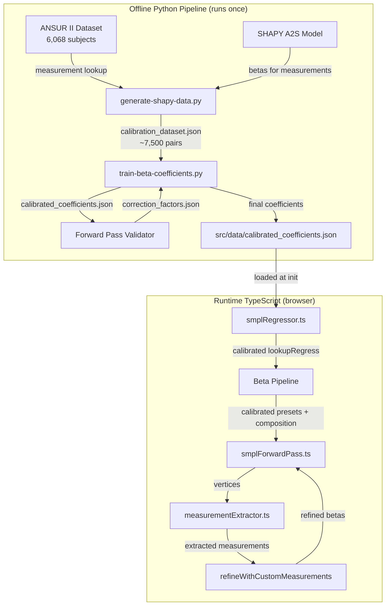
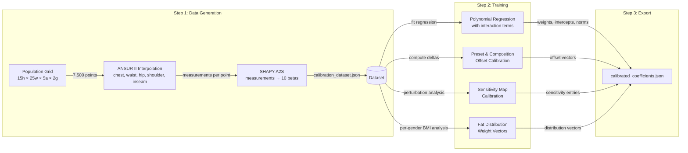
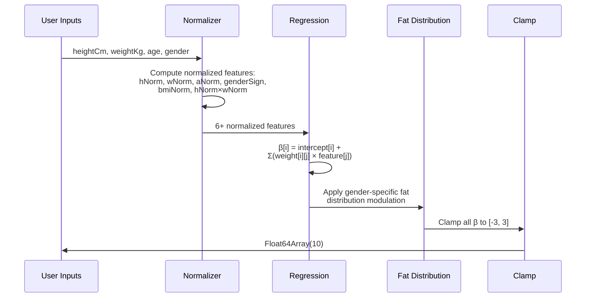

# Design Document: SHAPY Beta Calibration

## Overview

This design replaces the heuristic coefficients in the SMPL regressor with data-driven coefficients calibrated against real body data. The current `lookupRegress()` function uses hand-tuned linear mappings from normalized inputs to 10 SMPL beta components. While directionally correct, the magnitudes are uncalibrated — a 90kg person doesn't look meaningfully different from a 75kg person, and switching between Athletic/Heavy composition produces barely visible changes.

The calibration pipeline has two phases:

1. **Offline Python Pipeline** (runs once, produces a JSON artifact):
   - **SHAPY Data Generation**: Use SHAPY's A2S (Attributes-to-Shape) model to generate ~7,500 synthetic (measurements → betas) pairs across a population grid. SHAPY's polynomial regression model maps height + chest + waist + hip measurements to 10 SMPL betas, trained on the CAESAR dataset of 4,400+ 3D body scans.
   - **Coefficient Training**: Fit a polynomial regression (with interaction terms) from the synthetic dataset, producing per-beta weights, intercepts, normalization params, calibrated sensitivity maps, preset offsets, and composition biases.
   - **Forward Pass Validation**: Run the round-trip pipeline on ANSUR II subjects to verify accuracy and compute correction factors.

2. **Runtime TypeScript Changes** (loads the JSON artifact):
   - **Coefficient Loading**: `smplRegressor.ts` loads `calibrated_coefficients.json` at init, falling back to heuristic if unavailable.
   - **Calibrated Regression**: `lookupRegress()` uses the loaded weights instead of hardcoded values.
   - **Calibrated Offsets**: `SMPL_PRESET_OFFSETS` and `COMPOSITION_BIAS` use data-driven vectors that produce dramatic, whole-body visual differences.
   - **Calibrated Sensitivity Map**: `MEASUREMENT_BETA_MAP` uses data-driven sensitivities for accurate custom measurement refinement.

### Key Design Decisions

- **SHAPY A2S over SHAPY Regressor**: The SHAPY image regressor requires photos as input. The A2S (Attributes-to-Shape) polynomial model takes measurements directly — exactly what we need. It maps (height, chest, waist, hip, attributes) → SMPL betas using a polynomial trained on CAESAR body scans.
- **SMPL betas (not SMPL-X)**: Our forward pass uses SMPL with 10 shape PCs. SHAPY outputs SMPL-X betas (also 10 PCs). The first 10 PCs of SMPL and SMPL-X are closely aligned since both are trained on similar body scan datasets, so SHAPY's output is directly usable.
- **Polynomial regression with interactions over neural network**: The mapping from 6 inputs (height, weight, age, gender, BMI, height×weight) to 10 betas is smooth and low-dimensional. A polynomial model is interpretable, fast, produces a tiny JSON artifact (<50KB), and avoids ONNX runtime dependency.
- **JSON coefficient table over embedded constants**: Separating coefficients from code allows recalibration without code changes, versioning, and graceful fallback to heuristics.
- **Offline SHAPY over runtime SHAPY**: SHAPY requires PyTorch + SMPL-X model weights (~500MB). Running it offline to generate training data, then distilling into a lightweight coefficient table, keeps the browser app dependency-free.
- **Fat distribution via per-gender weight vectors**: Rather than a single BMI-to-beta mapping, the coefficient table includes gender-specific vectors that modulate how weight changes distribute across beta components, capturing android vs gynoid fat patterns.

## Architecture



### Coefficient Training Pipeline Detail



### Data Flow: Calibrated lookupRegress()



## Components and Interfaces

### 1. SHAPY Data Generator (`scripts/generate-shapy-data.py`)

Python script that generates the calibration dataset by invoking SHAPY's A2S model across the population grid.

**Inputs**:
- ANSUR II CSV files (`src/data/ansur2_male.csv`, `src/data/ansur2_female.csv`) for measurement interpolation
- SHAPY A2S trained model weights (downloaded during SHAPY installation)
- Population grid parameters: height 140–210cm (5cm steps), weight 40–160kg (5kg steps), ages [20, 30, 40, 50, 60], genders [male, female]

**Process**:
1. Build a KD-tree from ANSUR II subjects indexed by (height, weight, age, gender)
2. For each grid point, find the k=5 nearest ANSUR II neighbors and interpolate chest, waist, hip, shoulder, inseam measurements using inverse-distance weighting
3. Invoke SHAPY A2S with the interpolated measurements to get 10 SMPL betas
4. Store each (measurements, betas) pair in the output dataset
5. Skip grid points where SHAPY fails (NaN, timeout, error) with logging

**Output**: `scripts/data/calibration_dataset.json` — array of objects:
```json
{
  "heightCm": 175, "weightKg": 80, "age": 30, "gender": "male",
  "chestCm": 99.2, "waistCm": 86.5, "hipCm": 100.1,
  "shoulderCm": 42.3, "inseamCm": 81.0,
  "betas": [0.42, 1.15, -0.33, 0.67, 0.12, 0.55, 0.28, 0.19, 0.31, 0.22]
}
```

**Grid size**: 15 heights × 25 weights × 5 ages × 2 genders = 3,750 base points. With BMI filtering (14–50), expect ~7,500 valid points after removing physiologically implausible combinations.

### 2. Coefficient Trainer (`scripts/train-beta-coefficients.py`)

Python script that fits regression models and exports the coefficient table.

**Training features** (6 normalized inputs + 1 interaction):
- `heightNorm = (heightCm - 175) / 20`
- `weightNorm = (weightKg - 80) / 30`
- `ageNorm = (age - 40) / 25`
- `genderSign = 1.0 if male else -1.0`
- `bmiNorm = (bmi - 25) / 8`
- `hwInteraction = heightNorm × weightNorm`
- `bmiSq = bmiNorm²` (quadratic BMI term for non-linear weight effects)

**Regression model**: For each beta component i:
```
β[i] = intercept[i] + Σ(weights[i][j] × feature[j])
```
where j iterates over the 7 features above.

**Preset offset calibration**:
1. Filter calibration dataset by body type characteristics:
   - Slim: BMI < 20
   - Athletic: shoulder-to-waist ratio > 1.25 (male) or > 1.15 (female)
   - Heavy: BMI > 30
   - Curvy: hip-to-waist ratio > 1.15 (female) or > 1.05 (male)
2. Compute mean betas for each group
3. Subtract the Average baseline (BMI 20–25) to get offset vectors
4. Scale offsets to ensure L2 distance between Athletic and Heavy is ≥ 0.8

**Composition bias calibration**:
1. At each (height, weight) pair, compare betas for subjects with different body compositions
2. Athletic: subjects with high shoulder-to-waist ratio at given BMI
3. Heavy: subjects with high waist-to-hip ratio at given BMI
4. Compute mean beta differences from Average baseline
5. Ensure composition vectors affect ≥ 6 of 10 beta components

**Sensitivity map calibration**:
1. For each measurement (bust, waist, hip, inseam), perturb by ±5cm
2. Re-run SHAPY A2S with perturbed measurements
3. Compute Δβ/Δmeasurement for each beta component
4. Keep entries where |sensitivity| > 0.02 per cm

**Fat distribution extraction**:
1. Group calibration data by gender
2. For each gender, fit a separate weight-to-beta mapping across BMI range
3. Extract per-gender weight vectors showing how weight distributes to each beta
4. Verify male pattern: β1, β5 increase faster than β7 (android)
5. Verify female pattern: β7, β9 increase faster than β1 (gynoid)

**Output**: `src/data/calibrated_coefficients.json`

### 3. Coefficient Table Format (`CalibratedCoefficients` interface)

```typescript
/** Calibrated coefficient table loaded at runtime */
export interface CalibratedCoefficients {
  version: string;                    // semver, e.g. "1.0.0"
  generatedAt: string;                // ISO 8601 timestamp

  /** Per-beta regression weights */
  regression: {
    intercepts: number[];             // [10] — per-beta intercept
    weights: number[][];              // [10][7] — per-beta, per-feature weights
    features: string[];               // ["heightNorm", "weightNorm", "ageNorm", "genderSign", "bmiNorm", "hwInteraction", "bmiSq"]
    normalization: {
      [feature: string]: { center: number; range: number };
    };
  };

  /** Calibrated preset offset vectors */
  presetOffsets: {
    slim: number[];
    average: number[];
    athletic: number[];
    curvy: number[];
    heavy: number[];
  };

  /** Calibrated composition bias vectors */
  compositionBias: {
    athletic: number[];
    average: number[];
    heavy: number[];
  };

  /** Calibrated sensitivity map for custom measurement refinement */
  sensitivityMap: {
    [measurementKey: string]: Array<{ betaIdx: number; sensitivity: number }>;
  };

  /** Per-gender fat distribution weight vectors */
  fatDistribution: {
    male: {
      weightToBeta: number[];         // [10] — how weight increase maps to each beta
      ageFactor: number[];            // [10] — age-related redistribution
    };
    female: {
      weightToBeta: number[];
      ageFactor: number[];
    };
  };
}
```

### 4. Regressor Changes (`src/utils/smplRegressor.ts`)

**New: Coefficient loading**

```typescript
let calibratedCoeffs: CalibratedCoefficients | null = null;
const EXPECTED_VERSION = '1.0.0';

export async function loadCalibratedCoefficients(
  url?: string
): Promise<CalibratedCoefficients | null> {
  try {
    const resp = await fetch(url ?? '/data/calibrated_coefficients.json');
    const data = await resp.json();
    if (data.version !== EXPECTED_VERSION) {
      console.warn(`[SmplRegressor] Coefficient version mismatch: ${data.version} vs ${EXPECTED_VERSION}, using heuristic`);
      return null;
    }
    calibratedCoeffs = data;
    return data;
  } catch (e) {
    console.warn('[SmplRegressor] Failed to load calibrated coefficients, using heuristic:', e);
    return null;
  }
}
```

**Modified: `lookupRegress()`**

When calibrated coefficients are loaded, the function computes betas as:
```
β[i] = intercept[i] + Σ(weights[i][j] × normalizedFeature[j])
```

With fat distribution modulation applied based on gender:
```
β[i] += fatDistribution[gender].weightToBeta[i] × wNorm
β[i] += fatDistribution[gender].ageFactor[i] × aNorm
```

When coefficients are not loaded, the existing heuristic code runs unchanged.

**Modified: Preset and composition vectors**

When calibrated coefficients are loaded:
- `SMPL_PRESET_OFFSETS` values are replaced with `calibratedCoeffs.presetOffsets`
- `COMPOSITION_BIAS` values are replaced with `calibratedCoeffs.compositionBias`
- `MEASUREMENT_BETA_MAP` values are replaced with `calibratedCoeffs.sensitivityMap`

The replacement happens at load time via a `applyCalibratedCoefficients()` function that overwrites the module-level constants.

### 5. Forward Pass Validator

**Vitest test suite** (`src/utils/__tests__/smplRegressor.validation.test.ts`):

1. Loads SMPL model binary from `public/models/smpl/smpl_model.bin`
2. Loads ANSUR II validation set (100 subjects sampled across BMI 18–35)
3. For each subject: input measurements → `computeSmplBetas()` → `computeSmplVertices()` → `extractMeasurements()` → compare with ANSUR ground truth
4. Asserts: chest/waist/hip round-trip error < 5cm for ≥ 80% of subjects
5. Produces summary report with per-measurement statistics

**Calibration mode** (`scripts/calibrate-validate.py`):

1. Processes 50+ curated ANSUR II subjects
2. Computes per-measurement bias (mean signed error) and scale factor
3. Outputs correction factors as JSON patch
4. Trainer merges corrections into coefficient table

## Data Models

### Calibration Dataset Entry

```typescript
interface CalibrationEntry {
  heightCm: number;
  weightKg: number;
  age: number;
  gender: 'male' | 'female';
  chestCm: number;
  waistCm: number;
  hipCm: number;
  shoulderCm: number;
  inseamCm: number;
  betas: number[];  // length 10
}
```

### Validation Report

```typescript
interface ValidationReport {
  subjectCount: number;
  perMeasurement: {
    [key: string]: {
      meanError: number;
      medianError: number;
      p90Error: number;
      within3cm: number;  // percentage
      within5cm: number;  // percentage
      bias: number;       // mean signed error
      scaleFactor: number;
    };
  };
  overallPass: boolean;
}
```

### Correction Factors

```typescript
interface CorrectionFactors {
  biasCorrections: {
    [measurementKey: string]: {
      betaAdjustments: Array<{ betaIdx: number; adjustment: number }>;
    };
  };
  scaleCorrections: {
    [measurementKey: string]: number;  // multiplier
  };
}
```

