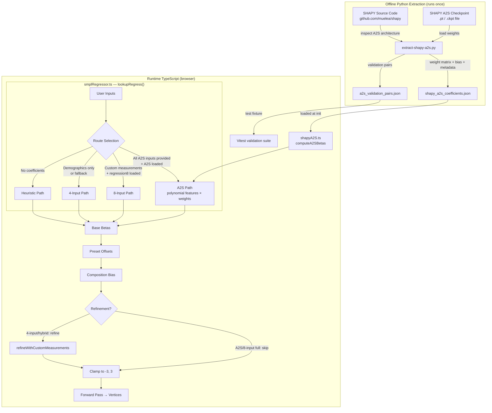
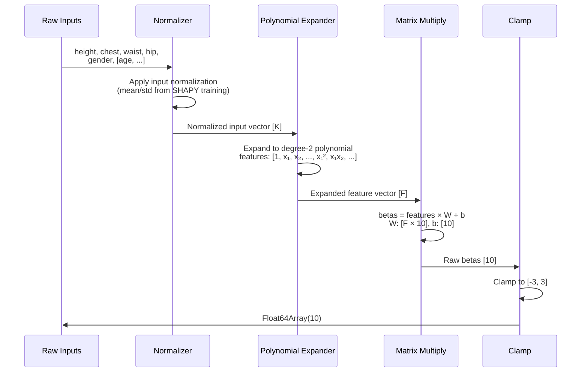
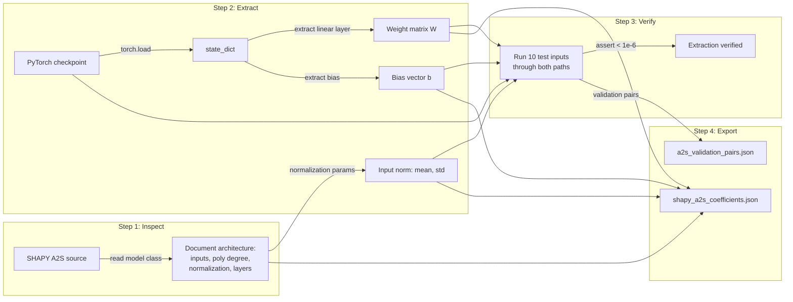

# Design Document: SHAPY Polynomial Extraction

## Overview

This design extracts SHAPY's internal A2S (Attributes-to-Shape) polynomial regression coefficients from the trained PyTorch model and replicates the exact computation in TypeScript. Instead of training our own regression on SHAPY's outputs (the current approach), we use SHAPY's actual weight matrices and polynomial feature expansion — producing floating-point-identical results to running SHAPY's Python code.

The implementation has three phases:

1. **Python Extraction** (runs once, produces JSON artifact):
   - Inspect SHAPY's A2S source code to understand the polynomial feature construction
   - Load the trained model checkpoint and extract weight matrix + bias vector
   - Verify extraction against the original model
   - Export as a compact JSON artifact (<100KB)

2. **TypeScript Replication** (new module):
   - `src/utils/shapyA2S.ts` — loads the coefficient artifact, implements the polynomial feature expansion, and computes betas via matrix multiplication
   - Pure math, no dependencies beyond the JSON artifact

3. **Pipeline Integration** (modifications to existing code):
   - `smplRegressor.ts` gains a three-tier routing: A2S → 8-input → 4-input → heuristic
   - A2S path is used when all required SHAPY inputs are available
   - Same layered pipeline (preset offsets, composition bias, clamp) applies after A2S base regression

### Key Design Decisions

- **Direct coefficient extraction over model distillation**: We extract the exact weight matrices rather than training a student model. This gives us mathematical equivalence with SHAPY, not an approximation.
- **Polynomial features in TypeScript over ONNX runtime**: SHAPY's A2S is a simple polynomial regression (degree 2, ~50-100 expanded features × 10 betas). This is a single matrix multiplication — no need for ONNX runtime, TensorFlow.js, or any ML framework. Pure TypeScript math.
- **Separate module (`shapyA2S.ts`) over inline in regressor**: The A2S logic is self-contained and independently testable. The regressor just calls it when available.
- **Separate coefficient artifact over merging into `calibrated_coefficients.json`**: The A2S coefficients come from a different source (SHAPY's trained model) than the calibrated coefficients (our own training pipeline). Keeping them separate avoids coupling and allows independent updates.
- **SMPL-X betas treated as SMPL betas**: SHAPY outputs SMPL-X betas (10 PCs). The first 10 PCs of SMPL and SMPL-X are closely aligned since both are trained on similar body scan datasets. We use SHAPY's output directly as SMPL betas.
- **Clamp to [-3, 3] at the A2S level**: Even though the pipeline also clamps at the end, clamping early prevents extreme A2S outputs from being amplified by preset/composition offsets.

## Architecture



### Data Flow: A2S Computation



### Extraction Pipeline Detail



## Components and Interfaces

### 1. A2S Coefficient Extractor (`scripts/extract-shapy-a2s.py`)

Python script that inspects the SHAPY A2S model, extracts coefficients, and exports them.

**Prerequisites**:
- SHAPY repository cloned and installed (or at least accessible)
- SHAPY A2S model checkpoint file (path provided as CLI argument)
- PyTorch installed

**Process**:
1. Import SHAPY's A2S model class and inspect its architecture
2. Load the trained checkpoint into the model
3. Identify the polynomial feature expansion (degree, interaction terms, ordering)
4. Extract the linear regression weight matrix and bias vector from the model's state dict
5. Extract any input normalization parameters (mean, std, min, max) used during training
6. Run 10 diverse test inputs through both the original model and the extracted matrices
7. Assert outputs match within 1e-6 absolute tolerance
8. Generate 100+ validation pairs for the TypeScript test suite
9. Export everything as JSON

**CLI interface**:
```bash
python scripts/extract-shapy-a2s.py \
  --checkpoint /path/to/shapy/a2s_model.pt \
  --shapy-dir /path/to/shapy/repo \
  --output src/data/shapy_a2s_coefficients.json \
  --validation-output scripts/data/a2s_validation_pairs.json
```

**Output: `src/data/shapy_a2s_coefficients.json`**:
```json
{
  "metadata": {
    "extractedAt": "2026-04-15T12:00:00Z",
    "shapyVersion": "sha256:abc123...",
    "polynomialDegree": 2,
    "inputFeatures": ["height", "chest", "waist", "hips"],
    "numInputFeatures": 4,
    "numExpandedFeatures": 15,
    "numBetas": 10,
    "notes": "Extracted from SHAPY A2S model trained on CAESAR dataset"
  },
  "normalization": {
    "inputMean": [170.0, 95.0, 80.0, 100.0],
    "inputStd": [10.0, 12.0, 12.0, 10.0]
  },
  "weights": [[/* 15 values for beta 0 */], /* ... 10 rows */],
  "bias": [/* 10 values */],
  "polynomialOrder": ["1", "x0", "x1", "x2", "x3", "x0^2", "x0*x1", "x0*x2", "x0*x3", "x1^2", "x1*x2", "x1*x3", "x2^2", "x2*x3", "x3^2"]
}
```

> Note: The exact structure of `inputFeatures`, `normalization`, `polynomialOrder`, and `weights` dimensions will be determined by inspecting the SHAPY source code. The above is an illustrative example assuming 4 inputs with degree-2 polynomial expansion. The actual SHAPY A2S model may have more inputs (e.g., gender, age attributes) or a different polynomial structure.

**Output: `scripts/data/a2s_validation_pairs.json`**:
```json
[
  {
    "inputs": {"height": 175.0, "chest": 98.0, "waist": 84.0, "hips": 100.0},
    "pythonBetas": [0.42, 1.15, -0.33, 0.67, 0.12, 0.55, 0.28, 0.19, 0.31, 0.22]
  },
  ...
]
```

### 2. A2S TypeScript Module (`src/utils/shapyA2S.ts`)

New module that replicates SHAPY's A2S polynomial computation in pure TypeScript.

**Interfaces**:

```typescript
/** Metadata from the extracted coefficient artifact */
export interface A2SMetadata {
  extractedAt: string;
  shapyVersion: string;
  polynomialDegree: number;
  inputFeatures: string[];
  numInputFeatures: number;
  numExpandedFeatures: number;
  numBetas: number;
  notes?: string;
}

/** Input normalization parameters from SHAPY training */
export interface A2SNormalization {
  inputMean: number[];   // [numInputFeatures]
  inputStd: number[];    // [numInputFeatures]
}

/** Complete A2S coefficient artifact loaded from JSON */
export interface A2SCoefficients {
  metadata: A2SMetadata;
  normalization: A2SNormalization;
  weights: number[][];          // [numBetas][numExpandedFeatures]
  bias: number[];               // [numBetas]
  polynomialOrder: string[];    // human-readable feature names
}

/** Inputs to the A2S computation — matches SHAPY's expected inputs */
export interface A2SInputs {
  heightCm: number;
  chestCm: number;
  waistCm: number;
  hipCm: number;
  // Additional fields TBD after SHAPY source inspection:
  // gender?: 'male' | 'female';
  // age?: number;
  // ... other semantic attributes SHAPY may expect
}
```

**Key functions**:

```typescript
/** Load A2S coefficients from JSON artifact */
export async function loadA2SCoefficients(url?: string): Promise<A2SCoefficients | null>;

/** Check if A2S coefficients are loaded and available */
export function isA2SAvailable(): boolean;

/** Check if the given inputs satisfy all A2S required fields */
export function hasAllA2SInputs(inputs: RegressorInputs): boolean;

/**
 * Compute SMPL betas using SHAPY's A2S polynomial regression.
 * 
 * Steps:
 * 1. Extract raw input vector from A2SInputs
 * 2. Normalize: (input - mean) / std
 * 3. Expand to polynomial features (degree 2)
 * 4. Matrix multiply: betas = features × W^T + b
 * 5. Clamp to [-3, 3]
 */
export function computeA2SBetas(inputs: A2SInputs): Float64Array;

/**
 * Expand a normalized input vector into polynomial features.
 * Replicates SHAPY's exact polynomial expansion.
 * 
 * For degree 2 with K inputs, produces:
 * [1, x₁, x₂, ..., xₖ, x₁², x₁x₂, ..., xₖ²]
 * Total features: 1 + K + K*(K+1)/2
 */
export function expandPolynomialFeatures(
  normalizedInputs: number[],
  degree: number,
): number[];
```

**Implementation notes**:
- The polynomial feature expansion must match SHAPY's exact ordering. This will be determined during the extraction step and encoded in the `polynomialOrder` field of the artifact.
- If SHAPY uses sklearn's `PolynomialFeatures`, the ordering is: bias (1), then degree-1 terms, then degree-2 terms in graded lexicographic order.
- The weight matrix dimensions are `[numBetas × numExpandedFeatures]`. The computation is: `betas[i] = Σ(weights[i][j] × features[j]) + bias[i]`.

### 3. Modified `smplRegressor.ts` — Route Selection

The `lookupRegress()` function gains a four-tier priority:

```typescript
export function lookupRegress(inputs: RegressorInputs): Float64Array {
  // Priority 1: A2S path (highest accuracy, requires specific measurements)
  if (isA2SAvailable() && hasAllA2SInputs(inputs)) {
    return computeA2SBetas({
      heightCm: inputs.heightCm,
      chestCm: inputs.bustCm!,   // bustCm maps to chestCm
      waistCm: inputs.waistCm!,
      hipCm: inputs.hipCm!,
      // ... additional fields as determined by SHAPY inspection
    });
  }

  // Priority 2: 8-input calibrated regression (when custom measurements available)
  if (calibratedCoeffs?.regression8 != null) {
    const customCount = +(inputs.bustCm != null) + +(inputs.waistCm != null)
                      + +(inputs.hipCm != null) + +(inputs.inseamCm != null);
    if (customCount > 0) {
      return regress8Input(inputs, customCount === 4);
    }
  }

  // Priority 3: 4-input calibrated regression
  if (calibratedCoeffs != null) {
    return regress4Input(inputs);
  }

  // Priority 4: Heuristic fallback
  return heuristicRegress(inputs);
}
```

**Modified `computeSmplBetas()`**:
- When A2S path is used with all required measurements, skip the refinement loop (same logic as full 8-input skip)
- Track which path was used via a module-level variable or return metadata

```typescript
/** Which regression path was used in the last lookupRegress() call */
export type RegressionPath = 'a2s' | '8-input' | '8-input-hybrid' | '4-input' | 'heuristic';
let lastRegressionPath: RegressionPath = 'heuristic';

export function getLastRegressionPath(): RegressionPath {
  return lastRegressionPath;
}
```

### 4. Initialization Flow

The A2S coefficients are loaded alongside the existing calibrated coefficients during engine initialization:

```typescript
// In engineInit.ts or bodyEngine.ts
async function initializeEngine() {
  // Load existing calibrated coefficients (4-input + 8-input)
  await loadCalibratedCoefficients();
  applyCalibratedCoefficients();

  // Load A2S coefficients (independent, optional)
  await loadA2SCoefficients();

  // Load SMPL model, etc.
  // ...
}
```

### 5. Validation Test Suite

**`src/utils/__tests__/shapyA2S.test.ts`** — Unit tests:
- Loading coefficient artifact
- Polynomial feature expansion correctness
- Beta computation with known inputs
- Clamping behavior
- `isA2SAvailable()` and `hasAllA2SInputs()` logic

**`src/utils/__tests__/shapyA2S.validation.test.ts`** — Validation against Python:
- Load `scripts/data/a2s_validation_pairs.json`
- For each pair, compute betas via TypeScript A2S
- Assert per-component difference < 1e-4

**`src/utils/__tests__/shapyA2S.prop.test.ts`** — Property-based tests:
- Beta boundedness for random inputs
- Polynomial feature expansion length invariant
- Continuity (small input change → small beta change)
- Round-trip through full pipeline
- Coefficient artifact parse-serialize round-trip

## Data Models

### A2S Coefficient Artifact

```typescript
interface A2SCoefficientArtifact {
  metadata: {
    extractedAt: string;          // ISO 8601
    shapyVersion: string;         // checkpoint hash or version
    polynomialDegree: number;     // typically 2
    inputFeatures: string[];      // ordered list of input names
    numInputFeatures: number;     // K
    numExpandedFeatures: number;  // 1 + K + K*(K+1)/2 for degree 2
    numBetas: number;             // 10
    notes?: string;
  };
  normalization: {
    inputMean: number[];          // [K] — mean of each input in training data
    inputStd: number[];           // [K] — std of each input in training data
  };
  weights: number[][];            // [numBetas][numExpandedFeatures]
  bias: number[];                 // [numBetas]
  polynomialOrder: string[];      // [numExpandedFeatures] — human-readable names
}
```

### Validation Pair

```typescript
interface A2SValidationPair {
  inputs: Record<string, number>;  // raw input measurements
  pythonBetas: number[];           // 10 betas from Python SHAPY A2S
}
```

### Regression Path Metadata

```typescript
type RegressionPath = 'a2s' | '8-input' | '8-input-hybrid' | '4-input' | 'heuristic';
```

## Correctness Properties

### Property 1: A2S Beta Boundedness (Invariant)
- **Requirement**: 9.1, 9.2
- **Type**: Invariant
- **Property**: For all valid A2S input combinations (height 150–200, chest 75–130, waist 60–120, hip 80–135), `computeA2SBetas()` returns a Float64Array of length 10 where every element is a finite number in [-3, 3].
- **Testable**: yes — property-based test with fast-check generating random valid A2S inputs.

### Property 2: Polynomial Feature Expansion Length (Invariant)
- **Requirement**: 4.2
- **Type**: Invariant
- **Property**: For all input vectors of length K and polynomial degree D, `expandPolynomialFeatures()` returns an array of length equal to the number of monomials up to degree D (for degree 2: 1 + K + K*(K+1)/2). The length is deterministic and depends only on K and D, not on the input values.
- **Testable**: yes — property-based test generating random input vectors of varying lengths.

### Property 3: A2S Coefficient Artifact Parse-Serialize Round-Trip
- **Requirement**: 3.5, 9.4
- **Type**: Round-trip
- **Property**: For all valid A2S coefficient artifacts, `JSON.parse(JSON.stringify(artifact))` produces an object where all numeric values in `weights`, `bias`, `normalization.inputMean`, and `normalization.inputStd` match the originals within 1e-10.
- **Testable**: yes — property-based test generating random coefficient structures.

### Property 4: A2S vs Python Equivalence (Example-based)
- **Requirement**: 6.1, 6.2
- **Type**: Example-based (validation dataset)
- **Property**: For all 100+ validation pairs in `a2s_validation_pairs.json`, the TypeScript `computeA2SBetas()` output differs from the Python SHAPY A2S output by less than 1e-4 per beta component.
- **Testable**: yes — example-based test loading validation dataset.

### Property 5: A2S Round-Trip Chest Within 5cm (Round-Trip)
- **Requirement**: 8.2
- **Type**: Round-trip
- **Property**: For all randomly generated valid A2S inputs, the full pipeline (inputs → `computeA2SBetas()` → `computeSmplVertices()` → `extractMeasurements()`) produces an extracted chest circumference within 5cm of the input chest value.
- **Testable**: yes — property-based test, 50+ iterations, SMPL model loaded once.

### Property 6: A2S Round-Trip Waist Within 5cm (Round-Trip)
- **Requirement**: 8.3
- **Type**: Round-trip
- **Property**: For all randomly generated valid A2S inputs, the extracted waist circumference is within 5cm of the input waist value.
- **Testable**: yes — property-based test, 50+ iterations.

### Property 7: A2S Round-Trip Hip Within 5cm (Round-Trip)
- **Requirement**: 8.4
- **Type**: Round-trip
- **Property**: For all randomly generated valid A2S inputs, the extracted hip circumference is within 5cm of the input hip value.
- **Testable**: yes — property-based test, 50+ iterations.

### Property 8: A2S Beta Continuity (Metamorphic)
- **Requirement**: 9.3
- **Type**: Metamorphic
- **Property**: For any valid A2S input, perturbing a single measurement by 1cm produces a beta vector where no component changes by more than 0.5 units. This ensures the polynomial regression is smooth and doesn't have discontinuities.
- **Testable**: yes — property-based test generating random inputs and perturbations.

### Property 9: Refinement Skip for A2S Path (Invariant)
- **Requirement**: 5.4
- **Type**: Invariant
- **Property**: When the A2S path is used with all required measurements, `computeSmplBetas()` produces the same betas as `computeA2SBetas()` + preset offsets + composition bias + clamp (no refinement step). The refinement loop is skipped.
- **Testable**: yes — property-based test comparing `computeSmplBetas()` output with manually composed pipeline output.

### Property 10: Backward Compatibility — 4-Input Path Identity (Invariant)
- **Requirement**: 10.1
- **Type**: Invariant
- **Property**: For all valid demographics-only inputs (no custom measurements, A2S not loaded), `lookupRegress()` produces identical output to the current implementation. The A2S extension does not alter the demographics-only path.
- **Testable**: yes — property-based test comparing outputs with and without A2S loaded.
