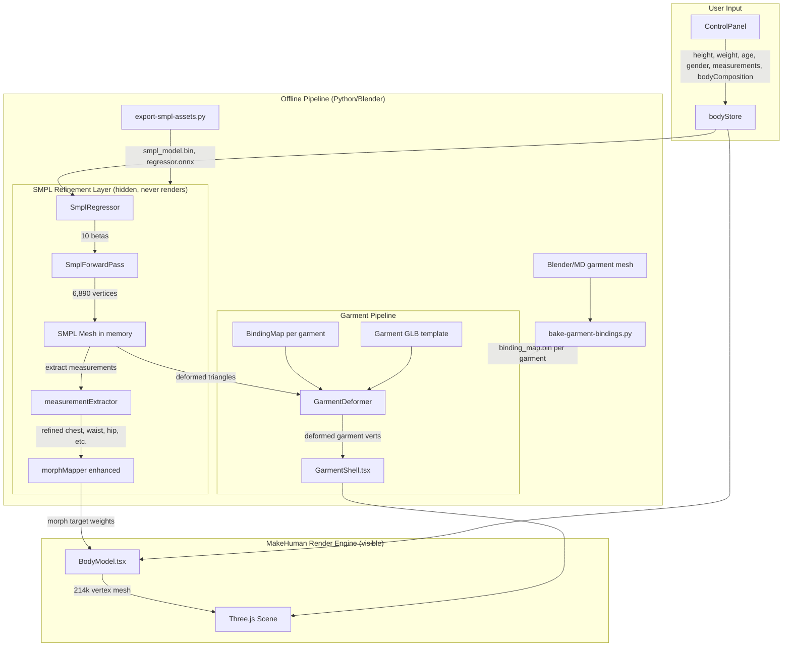

# SMPL Body & Garment Pipeline — Design Document

## Overview

This design implements SMPL as a **refinement layer** that sits on top of the existing MakeHuman avatar render engine — not as a replacement. The MakeHuman mesh (214k vertices, 25 morph targets, skin texture, smooth animations) remains the primary render engine. SMPL operates behind the scenes in two roles:

1. **Shape Oracle**: SMPL's measurement-to-shape regression produces better morph target weights for the existing MakeHuman model. User measurements (including body composition — athletic/average/heavy) → SMPL betas → extract body measurements from the SMPL mesh → map those measurements to MakeHuman morph target influences. The body composition signal is high-impact: SMPL's shape space captures the difference between a muscular 90kg person and a soft 90kg person, which height/weight alone cannot distinguish. This improves shape accuracy over the current ANSUR II + NHANES lookup table approach.

2. **Garment Binding Reference**: SMPL's standardized topology (~6,890 vertices, fixed vertex indices) serves as a reference mesh for garment binding. Garments bind to SMPL vertices via barycentric coordinates, then deformations transfer to the high-res MakeHuman mesh through a SMPL→MakeHuman vertex correspondence map. This makes garment fitting deterministic — vertex N on SMPL always means the same anatomical location.

The existing fully client-side architecture is preserved. SMPL forward pass runs in the browser via a pure TypeScript implementation (matrix math on typed arrays — the SMPL forward pass is just linear algebra: template + beta·blendshapes, no neural network inference needed). The measurement-to-beta regression uses either an ONNX model via ONNX Runtime Web or a precomputed lookup table, both client-side.

### Design Rationale

- **Refinement over replacement**: The MakeHuman system works well — 214k vertices with skin texture, smooth morph animations, proven heatmap pipeline. Replacing it would break all existing functionality. SMPL adds accuracy and garment binding without disrupting what works.
- **Pure TypeScript SMPL forward pass**: The SMPL forward pass is linear algebra (matrix multiply, vector add) on ~6,890 vertices × 10 shape components. No neural network needed. A typed-array implementation runs in <10ms, well under the 100ms budget. No ONNX dependency for the forward pass itself.
- **ONNX for regression only**: The measurement-to-beta regression (mapping height/weight/age/gender → 10 beta values) is the only part that benefits from ONNX. This is a tiny model (~1MB). Fallback: precomputed lookup table (same pattern as the existing ANSUR II model).
- **Dual mesh architecture**: SMPL mesh (6,890 verts) lives in memory but never renders. MakeHuman mesh (214k verts) renders. A precomputed correspondence map transfers SMPL deformations to MakeHuman space. Garments bind to SMPL, deform in SMPL space, then render directly (garment meshes are low-poly enough to render from SMPL-space positions).
- **Garment binding via barycentric coordinates**: Each garment vertex maps to a triangle on the SMPL body surface. When SMPL shape changes, the garment vertex follows the triangle. This is deterministic and fast — no cloth simulation at runtime.

## Architecture



### Data Flow

1. User enters measurements in ControlPanel (including body composition selector: Athletic/Average/Heavy) → stored in bodyStore.
2. `SmplRegressor` converts measurements + body composition → 10 SMPL beta values (client-side ONNX or lookup table). Body composition biases the beta vector toward muscular or soft shape distributions.
3. `SmplForwardPass` computes SMPL mesh vertices from betas (pure TypeScript linear algebra).
4. `measurementExtractor` measures the SMPL mesh (circumferences at key heights) → produces refined body measurements.
5. Enhanced `morphMapper` uses these refined measurements (instead of raw ANSUR II predictions) to compute MakeHuman morph target weights.
6. `BodyModel.tsx` applies morph weights to the MakeHuman mesh → renders as before with skin texture and smooth animation.
7. For garments: `GarmentDeformer` reads the current SMPL mesh vertices, evaluates each garment vertex's barycentric position on the SMPL surface + normal offset → produces deformed garment vertex positions.
8. `GarmentShell.tsx` updates garment BufferGeometry with deformed positions → renders garment on top of body.

### File Structure (New/Modified Files)

```
scripts/
  export-smpl-assets.py       # Convert SMPL model to browser-compatible binary
  bake-garment-bindings.py     # Compute binding maps for garment meshes on SMPL

public/models/smpl/
  smpl_model.bin               # SMPL template, blend shapes, face indices (~8-12MB)
  smpl_regressor.onnx          # Measurement-to-beta regression model (~1MB)
  smpl_landmarks.json          # Vertex index → anatomical landmark map
  smpl_to_makehuman.bin        # SMPL→MakeHuman vertex correspondence map

public/models/garments/
  tee-M.glb                    # Garment mesh (no morph targets)
  tee-M.binding.bin            # Binding map (per-vertex barycentric coords)
  ...

src/
  utils/
    smplForwardPass.ts         # Pure TS SMPL forward pass (linear algebra)
    smplRegressor.ts           # Measurement → beta regression (ONNX or lookup)
    measurementExtractor.ts    # Extract circumferences from SMPL mesh
    garmentDeformer.ts         # Barycentric garment deformation
    bindingMapCodec.ts         # Serialize/deserialize binding maps
    morphMapper.ts             # Enhanced with SMPL-refined measurements
  components/
    BodyModel.tsx              # Unchanged render pipeline
    GarmentShell.tsx           # Updated to use GarmentDeformer
```

## Components and Interfaces

### 1. `smplForwardPass.ts` — SMPL Forward Pass (Pure TypeScript)

Computes SMPL mesh vertex positions from shape parameters. No neural network — just linear algebra on typed arrays.

```typescript
/** SMPL model data loaded from binary asset */
export interface SmplModelData {
  templateVertices: Float32Array;   // 6890 × 3 = 20,670 floats (mean shape)
  shapeBlendShapes: Float32Array;   // 10 × 6890 × 3 = 206,700 floats (PCA components)
  faceIndices: Uint16Array;         // 13,776 × 3 = 41,328 (triangle connectivity)
  jointRegressor: Float32Array;     // 24 × 6890 (sparse, for joint locations)
  landmarkVertexIndices: Map<string, number>; // anatomical name → vertex index
}

/** Load SMPL model from binary asset file */
export async function loadSmplModel(url: string): Promise<SmplModelData>;

/**
 * Compute SMPL mesh vertices from beta parameters.
 * vertices = template + sum(beta[i] * shapeBlendShapes[i])
 * Pose is fixed to neutral (no pose blend shapes needed).
 * Modifies outputVertices in place for zero-allocation updates.
 */
export function computeSmplVertices(
  model: SmplModelData,
  betas: Float64Array,          // 10 shape coefficients
  outputVertices: Float32Array, // 6890 × 3, written in place
): void;

/** Get a named landmark position from computed vertices */
export function getSmplLandmark(
  model: SmplModelData,
  vertices: Float32Array,
  landmarkName: string,
): [number, number, number] | null;
```

The forward pass is: `V = T + Σ(βᵢ × Sᵢ)` where T is the template (6890×3), βᵢ are the 10 shape coefficients, and Sᵢ are the shape blend shapes. With pose fixed to neutral, there are no pose blend shapes or skinning to compute. This runs in <5ms on typed arrays.

### 2. `smplRegressor.ts` — Measurement-to-Beta Regression

Converts user measurements into SMPL beta parameters. Two strategies, with automatic fallback:

```typescript
export interface SmplRegressorConfig {
  mode: 'onnx' | 'lookup';
  onnxModelUrl?: string;
  lookupTableUrl?: string;
}

/**
 * Initialize the regressor. Tries ONNX first, falls back to lookup table.
 * Returns a function that maps measurements to betas.
 */
export async function initSmplRegressor(
  config?: Partial<SmplRegressorConfig>,
): Promise<SmplRegressorFn>;

export type SmplRegressorFn = (inputs: RegressorInputs) => Float64Array;

export type BodyComposition = 'athletic' | 'average' | 'heavy';

export interface RegressorInputs {
  heightCm: number;
  weightKg: number;
  age: number;
  gender: 'male' | 'female';
  bodyComposition?: BodyComposition; // defaults to 'average' if omitted
  bustCm?: number;
  waistCm?: number;
  hipCm?: number;
  inseamCm?: number;
}
```

**ONNX path**: Load `smpl_regressor.onnx` via `onnxruntime-web`, run inference with WebAssembly backend. Input: 4-9 floats (measurements + body composition encoded as a numeric value: athletic=0, average=1, heavy=2). Output: 10 floats (betas). ~5ms inference. Body composition shifts the beta prediction along the muscular↔soft axis in SMPL's shape space.

**Lookup table path**: Precomputed grid of measurement combinations (including body composition dimension) → beta vectors, with trilinear/quadrilinear interpolation (same pattern as the existing ANSUR II model). Stored as JSON. ~1ms lookup.

### 3. `measurementExtractor.ts` — Extract Measurements from SMPL Mesh

Measures the SMPL mesh at anatomical cross-sections to produce refined body measurements. These measurements are more accurate than the ANSUR II statistical predictions because they come from an actual 3D mesh shaped by the user's inputs.

```typescript
export interface ExtractedMeasurements {
  chestCm: number;
  waistCm: number;
  hipCm: number;
  shoulderCm: number;
  neckCm: number;
  bicepCm: number;
  thighCm: number;
  calfCm: number;
  wristCm: number;
  inseamCm: number;
}

/**
 * Extract body measurements from SMPL mesh vertices by computing
 * circumferences at known anatomical heights.
 * Uses the SMPL landmark map to identify cross-section planes.
 */
export function extractMeasurements(
  model: SmplModelData,
  vertices: Float32Array,
): ExtractedMeasurements;
```

The extraction works by slicing the SMPL mesh at known heights (using landmark vertex Y-coordinates to identify chest height, waist height, etc.) and computing the perimeter of the cross-section polygon. Since SMPL has fixed topology, the vertex indices at each height band are known and precomputed.

### 4. `garmentDeformer.ts` — Runtime Garment Deformation

Deforms garment template meshes to fit the current SMPL body shape using precomputed barycentric binding maps.

```typescript
export interface BindingEntry {
  faceIndex: number;      // SMPL triangle index
  baryU: number;          // barycentric coordinate u
  baryV: number;          // barycentric coordinate v
  baryW: number;          // barycentric coordinate w
  normalOffset: number;   // distance along interpolated normal (meters)
}

export interface BindingMap {
  version: number;
  vertexCount: number;
  entries: BindingEntry[];
}

/**
 * Deform garment vertices based on current SMPL body mesh.
 * For each garment vertex:
 *   1. Look up bound SMPL triangle from binding map
 *   2. Interpolate position using barycentric coords on current SMPL verts
 *   3. Interpolate normal from triangle vertex normals
 *   4. Offset along interpolated normal by normalOffset
 *   5. Write to output buffer
 */
export function deformGarment(
  bindingMap: BindingMap,
  smplVertices: Float32Array,    // current SMPL vertex positions (6890 × 3)
  smplNormals: Float32Array,     // current SMPL vertex normals (6890 × 3)
  smplFaces: Uint16Array,        // SMPL face indices (13776 × 3)
  outputPositions: Float32Array, // garment vertex positions (written in place)
): void;

/**
 * Compute vertex normals for SMPL mesh from face normals.
 * Needed for normal offset computation in garment deformation.
 */
export function computeSmplNormals(
  vertices: Float32Array,
  faces: Uint16Array,
  outputNormals: Float32Array,
): void;
```

Performance target: <16ms for a 10k-vertex garment. The inner loop is simple arithmetic (3 multiplies + 3 adds per vertex for barycentric interpolation, plus normal offset). On typed arrays this is well within budget.

### 5. `bindingMapCodec.ts` — Binding Map Serialization

Binary format for efficient storage and loading of binding maps.

```typescript
/** Magic number: "BMAP" in ASCII = 0x424D4150 */
export const BINDING_MAP_MAGIC = 0x424D4150;
export const BINDING_MAP_VERSION = 1;

/** Serialize a BindingMap to compact binary ArrayBuffer */
export function serializeBindingMap(map: BindingMap): ArrayBuffer;

/** Deserialize a BindingMap from binary ArrayBuffer */
export function deserializeBindingMap(buffer: ArrayBuffer): BindingMap;

/**
 * Binary format layout:
 *   Header (10 bytes):
 *     magic:        uint32  (4 bytes) — 0x424D4150 "BMAP"
 *     version:      uint16  (2 bytes)
 *     vertexCount:  uint32  (4 bytes)
 *   Per-vertex records (20 bytes each):
 *     faceIndex:    uint32  (4 bytes)
 *     baryU:        float32 (4 bytes)
 *     baryV:        float32 (4 bytes)
 *     baryW:        float32 (4 bytes)
 *     normalOffset: float32 (4 bytes)
 *   Total size: 10 + vertexCount × 20 bytes
 */
```

### 6. `morphMapper.ts` — Enhanced with SMPL Refinement

The existing `inputsToMorphs()` function is enhanced with an optional SMPL-refined measurements path:

```typescript
/**
 * Enhanced: if SMPL measurements are available, use them instead of
 * the ANSUR II lookup table predictions. The z-score computation and
 * morph mapping logic remains identical — only the input measurements change.
 *
 * Body composition (athletic/average/heavy) is also used:
 * - In SMPL mode: already encoded in the beta vector, so SMPL measurements reflect it.
 * - In MakeHuman-only mode: maps to existing bodyType morph modifiers
 *   (athletic → more Muscular/WiderShoulders, heavy → more Heavier/BiggerStomach).
 */
export function inputsToMorphs(
  u: UserInputs,
  smplMeasurements?: ExtractedMeasurements | null,
): Record<string, number>;
```

When `smplMeasurements` is provided, the function uses those values for chest, waist, hip, etc. instead of calling `lookupMeasurement()`. The z-score computation against population statistics and the morph target weight mapping remain unchanged. This is the "shape oracle" pattern — SMPL provides better measurement estimates, MakeHuman renders them.

### 7. `BodyModel.tsx` — Minimal Changes

The BodyModel component gains an optional SMPL refinement hook:

- On mount or when inputs change, if SMPL is available, run the SMPL pipeline (regressor → forward pass → measurement extraction) and pass refined measurements to `inputsToMorphs()`.
- If SMPL is not available (assets not loaded, error), fall back to the existing ANSUR II path. No visible change to the user.
- The MakeHuman mesh, skin texture, morph animation, heatmap vertex coloring — all unchanged.

### 8. `GarmentShell.tsx` — Updated for Binding-Based Deformation

Replaces the current morph-target-sync approach with binding-map-based deformation:

- Loads garment GLB (template mesh, no morph targets needed) + binding map binary.
- Each frame: calls `deformGarment()` with current SMPL vertices → updates garment BufferGeometry positions.
- Falls back to the existing morph-sync approach if binding map is not available (backward compatible with existing garment-tee-M.glb).
- Material upgraded from semi-transparent POC to opaque fabric appearance (MeshPhysicalMaterial with roughness, optional normal map).

### 9. Offline Scripts

#### `export-smpl-assets.py`

Converts SMPL model files (NumPy/pickle from MPI) into browser-compatible formats:
- `smpl_model.bin`: Template vertices, shape blend shapes, face indices, joint regressor — packed as typed arrays in a binary blob with a header.
- `smpl_regressor.onnx`: Trained measurement-to-beta regression model exported via PyTorch/ONNX.
- `smpl_landmarks.json`: Vertex index → landmark name mapping.
- `smpl_to_makehuman.bin`: Precomputed nearest-vertex correspondence from SMPL (6,890 verts) to MakeHuman (214k verts) for potential future use.

#### `bake-garment-bindings.py`

For each garment mesh (modeled in Blender or imported from Marvelous Designer):
1. Load SMPL model in neutral pose.
2. Load garment mesh positioned on the SMPL body.
3. For each garment vertex, find the nearest SMPL triangle via BVH ray casting.
4. Compute barycentric coordinates (u, v, w) on that triangle.
5. Compute normal offset distance.
6. Validate: no degenerate triangles, all vertices bound.
7. Export binding map as `.binding.bin`.
8. Export garment mesh as GLB (geometry only, no morph targets).

### 10. Garment Registry

```typescript
/** Registry entry for a garment template */
export interface GarmentRegistryEntry {
  type: GarmentType;
  label: string;
  sizes: string[];
  getGlbPath: (size: string) => string;
  getBindingPath: (size: string) => string;
}

/** Static registry — new garments added by editing this array */
export const garmentRegistry: GarmentRegistryEntry[] = [
  {
    type: 'tee',
    label: 'T-Shirt',
    sizes: ['XS', 'S', 'M', 'L', 'XL', 'XXL'],
    getGlbPath: (s) => `/models/garments/tee-${s}.glb`,
    getBindingPath: (s) => `/models/garments/tee-${s}.binding.bin`,
  },
  // ... oxford, slim-jeans, straight-jeans
];
```

## Data Models

### SMPL Model Binary Format (`smpl_model.bin`)

```
Header (16 bytes):
  magic:           uint32  — 0x534D504C ("SMPL")
  version:         uint16
  vertexCount:     uint16  — 6890
  faceCount:       uint16  — 13776
  shapeCount:      uint16  — 10
  landmarkCount:   uint16
  reserved:        uint16

Template vertices:    Float32Array[6890 × 3]     — 82,680 bytes
Shape blend shapes:   Float32Array[10 × 6890 × 3] — 826,800 bytes
Face indices:         Uint16Array[13776 × 3]      — 82,656 bytes
Joint regressor:      Float32Array[24 × 6890]     — 661,440 bytes (sparse, stored dense)
Landmark indices:     Uint16Array[landmarkCount × 2] — (index, nameStringOffset) pairs

Total: ~1.65 MB uncompressed, ~800KB gzipped
```

### Binding Map Binary Format (`*.binding.bin`)

```
Header (10 bytes):
  magic:       uint32  — 0x424D4150 ("BMAP")
  version:     uint16
  vertexCount: uint32

Per-vertex records (20 bytes each):
  faceIndex:    uint32
  baryU:        float32
  baryV:        float32
  baryW:        float32
  normalOffset: float32

Total for 5k-vertex garment: 10 + 100,000 = ~100KB
```

### SMPL Landmark Map (`smpl_landmarks.json`)

```json
{
  "left_shoulder": 3011,
  "right_shoulder": 6470,
  "navel": 3500,
  "left_hip": 1799,
  "right_hip": 5262,
  "left_knee": 1085,
  "right_knee": 4530,
  "left_ankle": 3327,
  "right_ankle": 6728,
  "neck_base": 3068,
  "chest_center": 3076,
  "waist_center": 3504,
  "hip_center": 1769
}
```

### Garment GLB Structure (New Format)

Each garment GLB contains:
- Single mesh with garment geometry (~2k–10k vertices)
- No morph targets (deformation handled by binding map at runtime)
- No skeleton
- UVs for future texture support
- Optional normal map for fabric detail

Naming: `{type}-{size}.glb` + `{type}-{size}.binding.bin`

### Body Engine Configuration

```typescript
/** Runtime configuration for body engine selection */
export interface BodyEngineConfig {
  engine: 'smpl-refined' | 'makehuman-only';
  smplModelUrl: string;
  smplRegressorUrl: string;
  smplLandmarksUrl: string;
}

// Default: try SMPL refinement, fall back to MakeHuman-only
const defaultConfig: BodyEngineConfig = {
  engine: 'smpl-refined',
  smplModelUrl: '/models/smpl/smpl_model.bin',
  smplRegressorUrl: '/models/smpl/smpl_regressor.onnx',
  smplLandmarksUrl: '/models/smpl/smpl_landmarks.json',
};
```

### Coordinate System Alignment

Both SMPL and MakeHuman meshes use the same coordinate convention:
- Y-up (Three.js / GLB standard)
- Z-negative = front (belly), Z-positive = back
- Origin: centered on X/Z, feet at Y=0

The SMPL export script applies the necessary rotation to match this convention (SMPL's native format uses a different orientation). The garment binding pipeline operates in this shared coordinate space.


## Correctness Properties

*A property is a characteristic or behavior that should hold true across all valid executions of a system — essentially, a formal statement about what the system should do. Properties serve as the bridge between human-readable specifications and machine-verifiable correctness guarantees.*

**PBT Applicability Assessment**: This feature has significant pure-function logic suitable for PBT: the SMPL forward pass (linear algebra), binding map serialization (round-trip), garment deformation (barycentric math), measurement extraction, and fit score computation. The offline Blender scripts (Requirements 3, 5) and Three.js rendering integration (Requirements 7, parts of 8) are not suitable for PBT. The regressor (Requirement 2) depends on trained model weights and is better tested with integration tests against reference outputs.

### Property 1: SMPL forward pass topology and coordinate invariant

*For any* SMPL beta vector with components in the range [-3, 3], the forward pass SHALL produce exactly 6,890 vertices and 13,776 triangular faces, with vertex positions in Y-up convention (feet near Y=0, centroid near X=0 and Z=0).

**Validates: Requirements 1.2, 1.6**

### Property 2: SMPL forward pass numerical equivalence

*For any* SMPL beta vector, the TypeScript forward pass SHALL produce vertex positions within 0.1mm (per-component) of pre-computed reference outputs generated by the Python SMPL implementation for the same beta inputs.

**Validates: Requirements 3.3**

### Property 3: Regressor output dimensionality

*For any* valid user input (height in [140, 210]cm, weight in [40, 150]kg, age in [18, 80], gender in {male, female}), the SMPL regressor SHALL produce exactly a 10-element beta vector with all components being finite numbers.

**Validates: Requirements 2.1**

### Property 4: Binding map serialization round-trip

*For any* valid BindingMap object (with vertex count > 0, face indices as non-negative integers, barycentric coordinates where u+v+w ≈ 1 and all ≥ 0, and finite normal offsets), serializing to binary and then deserializing SHALL produce a BindingMap with identical values.

**Validates: Requirements 9.3, 9.1, 9.2, 9.4**

### Property 5: Invalid binding map format rejection

*For any* ArrayBuffer whose first 4 bytes do not match the BMAP magic number (0x424D4150) or whose version field is not a recognized version, the deserializer SHALL throw an error with a descriptive message.

**Validates: Requirements 9.5**

### Property 6: Barycentric garment deformation correctness

*For any* SMPL body shape (beta in [-3, 3]) and any binding map entry with valid barycentric coordinates (u, v, w) on a non-degenerate SMPL triangle, the deformed garment vertex position SHALL equal the barycentric interpolation of the triangle's vertex positions plus the normal offset along the interpolated surface normal.

**Validates: Requirements 6.1, 6.4**

### Property 7: Garment non-interpenetration

*For any* SMPL body shape within beta range [-3, 3] per component, all deformed garment vertices (computed via binding map) SHALL have a positive signed distance from the body surface (i.e., the dot product of (garment_pos - nearest_body_surface_pos) with the surface normal is ≥ 0).

**Validates: Requirements 6.6**

### Property 8: Fit score algorithm invariance across engines

*For any* set of body measurements and garment measurements, the fit score computation (ease calculation, scoring against ease targets per fit preference) SHALL produce identical results regardless of whether the measurements originated from the SMPL pipeline or the MakeHuman/ANSUR II pipeline.

**Validates: Requirements 8.2**

### Property 9: Binding map validation catches degenerate entries

*For any* BindingMap containing at least one entry where the bound SMPL triangle has area < 0.0001 m² or where barycentric coordinates are invalid (u+v+w deviates from 1.0 by more than 0.001, or any component < 0), the validation function SHALL report the invalid entries.

**Validates: Requirements 5.5**

### Property 10: User input preservation across engine switch

*For any* set of user inputs (height, weight, age, gender, optional measurements, body composition), switching the body engine from MakeHuman to SMPL or vice versa SHALL preserve all input values (including body composition) in the store without modification.

**Validates: Requirements 11.3, 12.7**

### Property 11: Body composition produces distinct shapes

*For any* valid user input (height in [140, 210]cm, weight in [40, 150]kg, age in [18, 80], gender in {male, female}), the SMPL regressor SHALL produce different beta vectors for bodyComposition='athletic' vs bodyComposition='heavy' for the same height/weight/age/gender. Specifically, the L2 distance between the two beta vectors SHALL be > 0.1.

**Validates: Requirements 12.3, 12.4**

## Error Handling

### Offline Pipeline Errors

| Error Condition | Handling |
|----------------|----------|
| SMPL model files (NumPy/pickle) not found | `export-smpl-assets.py` exits with descriptive error |
| SMPL model has unexpected shape dimensions | Script validates shapes before export, exits with error |
| Garment mesh has no vertices near SMPL body surface | `bake-garment-bindings.py` warns about unbound vertices, skips garment |
| Binding map has degenerate triangles | Script logs warning per degenerate entry, continues (degenerate entries get fallback at runtime) |
| Output directory doesn't exist | Create with `os.makedirs(out_dir, exist_ok=True)` |
| ONNX export fails for regressor | Script logs error, suggests using lookup table fallback |

### Runtime Errors

| Error Condition | Handling |
|----------------|----------|
| SMPL model binary fails to load (404, corrupt) | Log warning, fall back to MakeHuman-only mode. No user-facing error. |
| SMPL regressor ONNX fails to load | Log warning, try lookup table fallback. If both fail, use MakeHuman-only mode. |
| SMPL forward pass produces NaN vertices | Detect NaN in output, fall back to previous valid vertex positions. Log error. |
| Binding map binary fails to load | Log warning, garment renders in template (undeformed) position. |
| Binding map has wrong magic number or version | `deserializeBindingMap()` throws descriptive error. Caller catches, falls back to morph-sync approach if available. |
| Garment GLB fails to load | Same as current: `console.warn()`, render body without garment. |
| Garment deformation produces NaN positions | Detect NaN, skip frame update, retain previous positions. Log error. |
| ONNX Runtime Web not supported in browser | Feature-detect WebAssembly support. If unavailable, fall back to lookup table regressor. |
| Binding map entry references out-of-bounds face index | Skip that vertex (retain template position), log warning. |

### Graceful Degradation Hierarchy

The system degrades gracefully through multiple fallback layers:

1. **Full SMPL pipeline** → SMPL regressor + forward pass + measurement extraction + garment binding deformation
2. **SMPL without ONNX** → Lookup table regressor + TypeScript forward pass (no ONNX dependency)
3. **MakeHuman-only** → Existing ANSUR II morph mapper + morph-target-sync garments (current behavior)
4. **No garment assets** → Body renders with heatmap on skin (Phase 1 behavior)

Each layer falls back automatically based on asset availability and runtime errors. The user never sees an error — the visualization just uses the best available engine.

## Testing Strategy

### Dual Testing Approach

- **Property-based tests** (fast-check): Validate universal properties of pure functions (forward pass, serialization, deformation, fit scores)
- **Unit tests** (Vitest): Verify specific examples, edge cases, material configuration, event emission
- **Integration tests**: Manual verification of offline pipeline output, Three.js rendering, engine switching
- **Reference tests**: Pre-computed Python outputs compared against TypeScript implementation

### Property-Based Tests

Library: [fast-check](https://github.com/dubzzz/fast-check) (already in devDependencies)
Framework: Vitest (already configured)
Minimum iterations: 100 per property test

| Property | Test File | Generator Strategy |
|----------|-----------|-------------------|
| 1: Forward pass topology/coordinate invariant | `src/utils/__tests__/smplForwardPass.test.ts` | Generate random Float64Array(10) with components in [-3, 3]. Run forward pass. Verify vertex count = 6890, face count = 13776, feet near Y=0. |
| 2: Forward pass numerical equivalence | `src/utils/__tests__/smplForwardPass.test.ts` | Load pre-computed reference outputs (Python-generated) for N random beta vectors. Run TypeScript forward pass. Verify per-component difference < 0.0001. |
| 3: Regressor output dimensionality | `src/utils/__tests__/smplRegressor.test.ts` | Generate random valid inputs (height, weight, age, gender). Run regressor. Verify output is Float64Array(10) with all finite values. |
| 4: Binding map round-trip | `src/utils/__tests__/bindingMapCodec.test.ts` | Generate random BindingMap objects: random vertex counts (1–5000), random face indices, random barycentric coords (normalized to sum=1), random normal offsets. Serialize then deserialize. Deep-equal check. |
| 5: Invalid format rejection | `src/utils/__tests__/bindingMapCodec.test.ts` | Generate random ArrayBuffers with wrong magic bytes or invalid version numbers. Verify deserializer throws. |
| 6: Barycentric deformation correctness | `src/utils/__tests__/garmentDeformer.test.ts` | Generate random SMPL vertices (or use reference mesh), random binding entries with valid barycentric coords. Run deformer. Verify output matches manual barycentric interpolation + normal offset. |
| 7: Garment non-interpenetration | `src/utils/__tests__/garmentDeformer.test.ts` | Generate random betas in [-3, 3], compute SMPL mesh, run deformation with reference binding map. Verify all garment vertices have positive signed distance from body surface. |
| 8: Fit score invariance | `src/utils/__tests__/heatmapEngine.test.ts` | Generate random body measurements and garment measurements. Compute fit scores. Verify result depends only on measurements and fit preference, not on engine source. |
| 9: Binding map validation | `src/utils/__tests__/garmentDeformer.test.ts` | Generate random binding maps with mix of valid and invalid entries (degenerate triangles, invalid barycentric coords). Run validation. Verify invalid entries detected. |
| 10: Input preservation on engine switch | `src/utils/__tests__/bodyStore.test.ts` | Generate random UserInputs (including bodyComposition). Set in store. Switch engine flag. Verify inputs unchanged. |
| 11: Body composition distinct shapes | `src/utils/__tests__/smplRegressor.test.ts` | Generate random valid inputs. Run regressor with bodyComposition='athletic' and 'heavy'. Verify L2 distance between beta vectors > 0.1. |

Each test tagged: **Feature: smpl-body-garment-pipeline, Property {N}: {title}**

### Unit Tests

| Test | File | Description |
|------|------|-------------|
| SMPL model loader parses valid binary | `smplForwardPass.test.ts` | Load reference binary, verify SmplModelData fields |
| SMPL model loader rejects truncated binary | `smplForwardPass.test.ts` | Truncate binary, verify error thrown |
| Forward pass with zero betas produces template mesh | `smplForwardPass.test.ts` | Beta = [0,...,0], verify output equals template vertices |
| Regressor falls back to lookup table on ONNX failure | `smplRegressor.test.ts` | Mock ONNX failure, verify lookup table used |
| measurementExtractor produces reasonable values | `measurementExtractor.test.ts` | Run on reference SMPL mesh, verify chest/waist/hip in human range |
| Garment deformer handles degenerate triangle fallback | `garmentDeformer.test.ts` | Create binding with zero-area triangle, verify nearest-vertex fallback |
| Garment material config for cotton vs denim | `garmentMaterial.test.ts` | Verify material properties per garment type |
| Heatmap coverage uses landmarks when SMPL active | `heatmapEngine.test.ts` | Verify landmark-based coverage for known garment |
| Registry provides correct paths for all garment types | `garmentRegistry.test.ts` | Verify path format for each type+size |
| Engine switch preserves garment selection | `bodyStore.test.ts` | Switch engine, verify garment type/size unchanged |

### Integration Tests (Manual)

| Test | Verification |
|------|-------------|
| Run `export-smpl-assets.py` | Output files exist, sizes within budget |
| Run `bake-garment-bindings.py` for tee M | GLB + binding.bin exist, binding covers all vertices |
| Load SMPL model in browser | No console errors, forward pass completes |
| Change body inputs with SMPL active | Body shape updates smoothly, measurements change |
| Toggle between SMPL and MakeHuman | Smooth transition, no visual glitch, inputs preserved |
| Load garment with binding map | Garment deforms to match body shape |
| Change body with garment loaded | Garment follows body shape changes in real-time |
| Enable heatmap with SMPL + garment | Heatmap colors appear on garment, correct fit regions |
| SMPL assets missing | Falls back to MakeHuman, no errors |

### Test Configuration

- Framework: Vitest
- PBT library: fast-check (v4.6.0)
- Minimum iterations: 100 per property test
- Test locations: `src/utils/__tests__/smplForwardPass.test.ts`, `src/utils/__tests__/bindingMapCodec.test.ts`, `src/utils/__tests__/garmentDeformer.test.ts`, `src/utils/__tests__/smplRegressor.test.ts`, `src/utils/__tests__/bodyStore.test.ts`
- Run: `npm test`
- Reference data: Pre-computed Python outputs stored in `src/utils/__tests__/fixtures/` for cross-implementation verification
