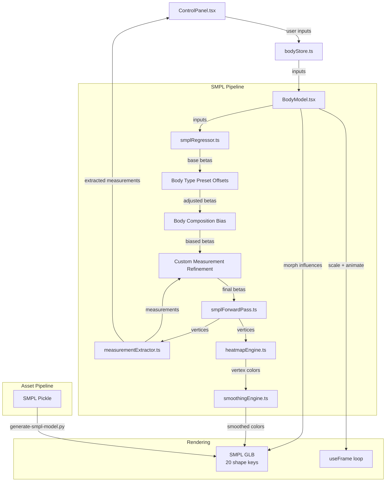
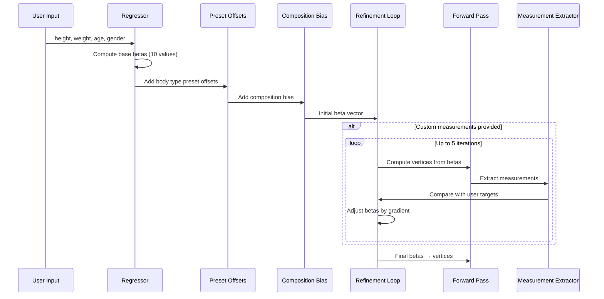

# Design Document: SMPL Feature Parity

## Overview

This design brings the SMPL body engine to full feature parity with the MakeHuman engine. The current SMPL infrastructure (forward pass, regressor, measurement extractor, body engine abstraction) was built in Session 005 but has functional gaps: morph targets only support positive betas, body type presets aren't wired to the SMPL regressor, heatmap doesn't render on the SMPL mesh, estimated measurements aren't displayed in SMPL mode, and beta transitions aren't animated for negative values.

The design addresses 9 requirements across 3 layers:

1. **Asset Pipeline** (Req 1): Extend the Blender export script to generate paired positive/negative morph targets (20 total shape keys), enabling the full beta range [-3, 3].
2. **Regressor & Mapping** (Reqs 2–4, 7): Enhance `smplRegressor.ts` to incorporate body type preset offsets, body composition biases, and custom measurement refinement deltas on top of the base height/weight/age/gender beta vector. Add an iterative refinement loop that adjusts betas until extracted measurements converge within tolerance of user-entered custom values.
3. **Rendering & UI** (Reqs 5–6, 8): Wire heatmap vertex coloring to the SMPL mesh with Laplacian smoothing, display SMPL-extracted measurements in the Estimated Measurements Panel, and extend the animation system to handle 20 morph targets with smooth positive↔negative transitions.
4. **Evaluation** (Req 9): Document a comparison of SMPL vs MakeHuman and recommend an architectural path forward.

### Key Design Decisions

- **Paired morph targets over signed influence**: Three.js morph target influences are clamped to [0, 1]. Rather than patching Three.js or using a custom shader, we use paired shape keys (Beta0 + Beta0Neg) — the standard approach for bidirectional deformation in glTF.
- **Iterative refinement for custom measurements**: The regressor produces an initial beta vector from heuristics, then runs up to 5 Newton-style correction iterations comparing extracted mesh measurements against user targets. This avoids training a separate inverse model while achieving <3cm accuracy.
- **Beta layering order**: base (height/weight/age/gender) → body type preset offsets → body composition bias → custom measurement refinement. Each layer is additive, preserving the overall shape while correcting specific regions.
- **Heatmap reuse**: The existing `computeHeatmapSmpl()` function already handles SMPL landmark-based region mapping. The gap is in `BodyModel.tsx` which doesn't apply vertex colors to the SMPL mesh — this is a wiring fix, not an algorithm change.

## Architecture



### Data Flow for Beta Computation



## Components and Interfaces

### 1. Blender Export Script (`scripts/generate-smpl-model.py`)

**Changes**: Add negative morph target generation loop.

For each of the 10 beta PCs, the script currently generates one shape key at `beta = +3.0`. The update adds a second shape key at `beta = -3.0`:

```python
# Existing: Beta0 through Beta9 (positive direction)
# New: Beta0Neg through Beta9Neg (negative direction)
for pc_idx in range(NUM_SHAPES):
    # Positive target (existing)
    name_pos = f"Beta{pc_idx}"
    displacements_pos = shapedirs[:, :, pc_idx] * BETA_SCALE  # +3.0
    
    # Negative target (new)
    name_neg = f"Beta{pc_idx}Neg"
    displacements_neg = shapedirs[:, :, pc_idx] * (-BETA_SCALE)  # -3.0
```

**Output**: GLB with 21 shape keys (Basis + 10 positive + 10 negative), estimated ~107 MB.

### 2. SMPL Regressor (`src/utils/smplRegressor.ts`)

**New exports**:

```typescript
/** Beta offsets for each body type preset */
export interface SmplPresetOffsets {
  slim: Float64Array;
  average: Float64Array;
  athletic: Float64Array;
  curvy: Float64Array;
  heavy: Float64Array;
}

/** Full regressor pipeline: base → preset → composition → refinement */
export function computeSmplBetas(inputs: RegressorInputs): Float64Array;
```

**Layered computation**:

1. `lookupRegress(inputs)` → base 10-beta vector (existing)
2. `applyPresetOffsets(betas, bodyType)` → add preset-specific deltas
3. `applyCompositionBias(betas, composition)` → add composition shifts (existing logic, extracted to named function)
4. `refineWithCustomMeasurements(betas, customMeasurements, model)` → iterative correction loop (new)

**Preset offset vectors** (stored in `smplRegressor.ts` as constants):

| Preset   | β0 (size) | β1 (BMI) | β2 (h/w ratio) | β3 (shoulder/hip) | β4 (limbs) | β5 (torso width) | β6 (chest depth) | β7 (hip width) | β8 (arm thick) | β9 (leg thick) |
|----------|-----------|----------|-----------------|--------------------|-----------|--------------------|-------------------|----------------|----------------|----------------|
| Slim     | -0.3      | -0.8     | +0.5            | 0                  | 0         | -0.5               | -0.3              | -0.3           | -0.3           | -0.3           |
| Average  | 0         | 0        | 0               | 0                  | 0         | 0                  | 0                 | 0              | 0              | 0              |
| Athletic | +0.2      | -0.3     | +0.3            | +0.8               | 0         | -0.2               | +0.4              | -0.2           | +0.6           | +0.5           |
| Curvy    | 0         | +0.2     | -0.2            | -0.4               | 0         | -0.3               | +0.5              | +0.8           | 0              | +0.3           |
| Heavy    | +0.3      | +0.8     | -0.4            | -0.2               | 0         | +0.6               | +0.3              | +0.4           | +0.2           | +0.3           |

### 3. Custom Measurement Refinement

**New function in `smplRegressor.ts`**:

```typescript
interface RefinementConfig {
  maxIterations: number;    // default: 5
  toleranceCm: number;      // default: 3.0
  learningRate: number;     // default: 0.3
}

/**
 * Iteratively adjust betas so that extracted mesh measurements
 * converge toward user-specified custom measurements.
 * 
 * For each custom measurement (bust, waist, hip, inseam):
 *   1. Run forward pass with current betas
 *   2. Extract measurement from mesh
 *   3. Compute error = target - extracted
 *   4. Adjust the most relevant beta by error * learningRate / sensitivity
 * 
 * Sensitivity is estimated from the known beta-to-measurement mapping:
 *   - bust → β6 (chest depth), β5 (torso width)
 *   - waist → β1 (BMI), β5 (torso width)
 *   - hip → β7 (hip width)
 *   - inseam → β4 (limb proportions)
 */
export function refineWithCustomMeasurements(
  betas: Float64Array,
  targets: Partial<Record<'bustCm' | 'waistCm' | 'hipCm' | 'inseamCm', number>>,
  model: SmplModelData,
): Float64Array;
```

### 4. BodyModel.tsx — Morph Target Driving

**Changes to SMPL morph target mapping**:

```typescript
// Current: only positive targets
// Beta0-Beta9, influence = max(0, beta/3)

// New: paired positive/negative targets
// For beta[i] >= 0: Beta{i} = beta[i]/3, Beta{i}Neg = 0
// For beta[i] < 0:  Beta{i} = 0, Beta{i}Neg = abs(beta[i])/3
morphNamesRef.current.forEach((name, idx) => {
  const match = name.match(/^Beta(\d+)(Neg)?$/);
  if (!match) { targetInfluences.current[idx] = 0; return; }
  
  const betaIdx = parseInt(match[1], 10);
  const isNeg = match[2] === 'Neg';
  const betaVal = betaIdx < betas.length ? betas[betaIdx] : 0;
  
  if (isNeg) {
    targetInfluences.current[idx] = Math.max(0, Math.min(1, -betaVal / 3.0));
  } else {
    targetInfluences.current[idx] = Math.max(0, Math.min(1, betaVal / 3.0));
  }
});
```

**Heatmap wiring** (currently missing for SMPL):

The existing `computeHeatmapSmpl()` function works correctly. The gap is that `BodyModel.tsx` doesn't apply vertex colors to the SMPL mesh geometry. The fix adds vertex color attribute setting in the heatmap `useEffect`, using the same pattern as MakeHuman mode but reading positions/normals from the SMPL mesh.

### 5. ControlPanel.tsx — Estimated Measurements

**Changes**: The `estimatedMeasurements()` function already supports SMPL measurements via the `smplMeasurements` parameter. The gap is that `ControlPanel.tsx` doesn't pass SMPL measurements to it. The fix:

1. Subscribe to `SmplEngine.lastMeasurements` via a new store field `smplMeasurements`
2. Pass to `estimatedMeasurements(inputs, smplMeasurements)` in the `useMemo`

### 6. SmplEngine — Layered Beta Computation

**Changes to `bodyEngine.ts`**:

The `SmplEngine.update()` method currently calls `this.regressor(inputs)` directly. The update replaces this with the new `computeSmplBetas()` pipeline that includes preset offsets, composition bias, and custom measurement refinement.

```typescript
update(inputs: UserInputs): void {
  // New layered pipeline
  this.betas = computeSmplBetas({
    heightCm: inputs.heightCm,
    weightKg: inputs.weightKg,
    age: inputs.age,
    gender: inputs.gender,
    bodyComposition: inputs.bodyComposition ?? 'average',
    bodyType: inputs.bodyType,
    bustCm: inputs.bustCm ?? undefined,
    waistCm: inputs.waistCm ?? undefined,
    hipCm: inputs.hipCm ?? undefined,
    inseamCm: inputs.inseamCm ?? undefined,
  }, this.model);
  
  computeSmplVertices(this.model, this.betas, this.vertices);
  computeSmplNormals(this.vertices, this.model.faceIndices, this.normals);
  this._lastMeasurements = extractMeasurements(this.model, this.vertices);
  bodyEngineEvents.dispatchEvent(new Event(MESH_UPDATED_EVENT));
}
```


## Data Models

### Beta Preset Offsets

```typescript
/** Preset beta offsets — additive on top of base regressor output */
const SMPL_PRESET_OFFSETS: Record<BodyType, Float64Array> = {
  slim:     new Float64Array([-0.3, -0.8, +0.5, 0, 0, -0.5, -0.3, -0.3, -0.3, -0.3]),
  average:  new Float64Array([0, 0, 0, 0, 0, 0, 0, 0, 0, 0]),
  athletic: new Float64Array([+0.2, -0.3, +0.3, +0.8, 0, -0.2, +0.4, -0.2, +0.6, +0.5]),
  curvy:    new Float64Array([0, +0.2, -0.2, -0.4, 0, -0.3, +0.5, +0.8, 0, +0.3]),
  heavy:    new Float64Array([+0.3, +0.8, -0.4, -0.2, 0, +0.6, +0.3, +0.4, +0.2, +0.3]),
};
```

### Body Composition Bias Vectors

```typescript
/** Composition bias — additive shifts for athletic/average/heavy */
const COMPOSITION_BIAS: Record<BodyComposition, Float64Array> = {
  athletic: new Float64Array([0, -0.2, +0.1, +0.4, 0, -0.3, +0.2, -0.1, +0.4, +0.3]),
  average:  new Float64Array([0, 0, 0, 0, 0, 0, 0, 0, 0, 0]),
  heavy:    new Float64Array([0, +0.3, -0.1, -0.2, 0, +0.4, -0.1, +0.2, -0.2, +0.1]),
};
```

### Custom Measurement → Beta Sensitivity Map

Maps each custom measurement to the beta components it primarily affects, with estimated sensitivity (cm change per unit beta change):

```typescript
const MEASUREMENT_BETA_MAP: Record<string, Array<{ betaIdx: number; sensitivity: number }>> = {
  bustCm:   [{ betaIdx: 6, sensitivity: 4.0 }, { betaIdx: 5, sensitivity: 3.0 }],
  waistCm:  [{ betaIdx: 1, sensitivity: 5.0 }, { betaIdx: 5, sensitivity: 3.5 }],
  hipCm:    [{ betaIdx: 7, sensitivity: 4.5 }],
  inseamCm: [{ betaIdx: 4, sensitivity: 3.0 }],
};
```

### Store Extensions

```typescript
// New field in bodyStore.ts
interface BodyStore {
  // ... existing fields ...
  smplMeasurements: ExtractedMeasurements | null;
  setSmplMeasurements: (m: ExtractedMeasurements | null) => void;
}
```

### Morph Target Naming Convention

| Shape Key Name | Direction | Beta Range | Influence Formula |
|---------------|-----------|------------|-------------------|
| `Beta0`       | Positive  | [0, 3]    | `beta[0] / 3.0`  |
| `Beta0Neg`    | Negative  | [-3, 0]   | `abs(beta[0]) / 3.0` |
| `Beta1`       | Positive  | [0, 3]    | `beta[1] / 3.0`  |
| `Beta1Neg`    | Negative  | [-3, 0]   | `abs(beta[1]) / 3.0` |
| ...           | ...       | ...        | ...               |
| `Beta9`       | Positive  | [0, 3]    | `beta[9] / 3.0`  |
| `Beta9Neg`    | Negative  | [-3, 0]   | `abs(beta[9]) / 3.0` |


## Correctness Properties

*A property is a characteristic or behavior that should hold true across all valid executions of a system — essentially, a formal statement about what the system should do. Properties serve as the bridge between human-readable specifications and machine-verifiable correctness guarantees.*

### Property 1: Beta-to-influence mapping correctness

*For any* 10-element beta vector with values in [-3, 3], the morph target influence mapping SHALL assign: for each component i, if beta[i] >= 0 then influence(Beta{i}) = beta[i]/3 clamped to [0,1] and influence(Beta{i}Neg) = 0; if beta[i] < 0 then influence(Beta{i}Neg) = abs(beta[i])/3 clamped to [0,1] and influence(Beta{i}) = 0.

**Validates: Requirements 1.2, 1.3**

### Property 2: Forward pass mesh validity

*For any* 10-element beta vector with values in [-3, 3], the SMPL forward pass SHALL produce a vertex array where all values are finite (no NaN or Infinity), the bounding box has positive volume (maxY - minY > 0.5m), and no vertex is more than 3 meters from the origin.

**Validates: Requirements 1.4**

### Property 3: Mesh height accuracy

*For any* height input in [140, 210] cm (with weight, age, gender at defaults), the SMPL regressor + forward pass SHALL produce a mesh whose height (maxY - minY, converted to cm) is within 5% of the input heightCm.

**Validates: Requirements 2.2**

### Property 4: Mesh measurement accuracy vs ANSUR II

*For any* valid user input combination (height in [150, 200], weight in [50, 120], age in [18, 65], gender in {male, female}), the SMPL pipeline SHALL produce chest, waist, and hip circumferences (via measurementExtractor) that are each within 5cm of the ANSUR II lookup table predictions for the same inputs.

**Validates: Requirements 2.3**

### Property 5: Gender dimorphism in regressor

*For any* height in [155, 195], weight in [55, 110], and age in [18, 60], the SMPL regressor SHALL produce a β3 (shoulder-to-hip ratio) value for male that is greater than the β3 value for female with the same height, weight, and age.

**Validates: Requirements 2.4**

### Property 6: Age effect on regressor

*For any* height in [155, 195], weight in [55, 110], and gender, the SMPL regressor SHALL produce β1 (weight/BMI) and β5 (torso width) values for age=55 that are greater than or equal to the corresponding values for age=25 with the same height, weight, and gender.

**Validates: Requirements 2.5**

### Property 7: Body type preset offsets are additive

*For any* valid user input combination and any body type preset, the beta vector produced by computeSmplBetas with that preset SHALL equal the beta vector produced with the Average preset plus the preset's offset vector (element-wise addition), before clamping.

**Validates: Requirements 3.1, 3.3, 3.4, 3.5, 3.6, 3.7**

### Property 8: Custom measurement refinement convergence

*For any* valid user input combination and any single custom measurement (bust in [75, 130], waist in [60, 130], hip in [80, 135], or inseam in [65, 95] cm), the refinement loop SHALL produce a beta vector where the corresponding measurement extracted from the SMPL mesh is within 3cm of the user-specified target.

**Validates: Requirements 4.1, 4.2, 4.3, 4.4**

### Property 9: Clearing custom measurement reverts betas

*For any* valid user input combination, computing betas with no custom measurements SHALL produce the same beta vector as computing betas with a custom measurement set to null (cleared).

**Validates: Requirements 4.5**

### Property 10: Refinement preserves non-targeted betas

*For any* valid user input combination and a single custom measurement adjustment, the beta components NOT in the measurement's sensitivity map SHALL change by less than 0.5 compared to the betas computed without that custom measurement.

**Validates: Requirements 4.6**

### Property 11: Display rule for custom vs extracted measurements

*For any* custom measurement value C and SMPL-extracted measurement value E where |C - E| > 3cm, the displayed measurement SHALL equal E (the SMPL-extracted value), not C.

**Validates: Requirements 6.4**

### Property 12: Body composition bias is additive

*For any* valid user input combination and any body composition (athletic, average, heavy), the beta vector produced by computeSmplBetas with that composition SHALL equal the beta vector produced with average composition plus the composition's bias vector (element-wise addition), before clamping and before custom measurement refinement.

**Validates: Requirements 7.4**

### Property 13: Damping function convergence

*For any* current value, target value, speed > 0, and deltaTime in (0, 0.05], the damping function `damp(cur, tgt, speed, dt)` SHALL return a value that is strictly between cur and tgt (exclusive) when cur ≠ tgt, and equal to tgt when cur = tgt.

**Validates: Requirements 8.1**

### Property 14: Morph influence sum invariant during transitions

*For any* beta component i and any sequence of beta values transitioning from positive to negative (or vice versa), at every animation frame the sum `influence(Beta{i}) + influence(Beta{i}Neg)` SHALL be less than or equal to 1.0, preventing double-deformation artifacts.

**Validates: Requirements 8.3**


## Error Handling

### Blender Export Script
- **Missing SMPL pickle**: Script exits with clear error message and non-zero exit code.
- **Insufficient disk space**: Blender's GLB export will fail; script catches and reports.
- **Shape key count mismatch**: If SMPL pickle has fewer than 10 PCs, script warns and generates only available PCs (both positive and negative).

### SMPL Regressor
- **NaN/Infinity in inputs**: `computeSmplBetas` validates inputs and clamps to safe ranges before computation. Height clamped to [100, 250], weight to [20, 300], age to [10, 100].
- **Beta overflow**: All betas clamped to [-3, 3] after each computation layer (base, preset, composition, refinement).
- **Refinement divergence**: If the iterative refinement loop doesn't converge within `maxIterations`, it returns the best-so-far betas and logs a warning. No error thrown — the mesh will be approximate but valid.
- **Missing SMPL model data**: `refineWithCustomMeasurements` requires `SmplModelData` for the forward pass. If not available (MakeHuman mode), custom measurements fall back to the existing ANSUR II lookup path.

### BodyModel Morph Target Driving
- **Missing morph targets**: If the GLB doesn't contain expected `BetaNeg` targets (e.g., old GLB without regeneration), the code gracefully ignores missing targets — negative betas will have no visual effect, but no crash occurs.
- **Morph target name mismatch**: The regex `/^Beta(\d+)(Neg)?$/` safely ignores non-matching shape key names.
- **NaN in morph influences**: All influences are clamped to [0, 1] and checked for `isFinite` before assignment.

### Heatmap on SMPL Mesh
- **No vertex normals**: If the SMPL mesh geometry lacks normal attributes, `normalXAbs` and `normalYAbs` default to 0, which disables arm detection (all vertices treated as torso). This is a degraded but functional state.
- **Empty vertex positions**: If `SmplEngine.getVertexPositions()` returns an empty array (engine not initialized), heatmap computation returns null and skin material is shown.
- **Adjacency build failure**: If the SMPL mesh has no index buffer, adjacency map is null and smoothing is skipped. Heatmap still renders, just without smoothing.

### Estimated Measurements Display
- **Null SMPL measurements**: When `smplMeasurements` is null (engine not ready or MakeHuman mode), the panel falls back to ANSUR II lookup estimates — existing behavior.
- **Measurement extractor returns 0**: If a circumference measurement returns 0 (no vertices in band), the panel displays 0 with no special handling — this indicates a mesh issue that should be investigated.

### Animation System
- **Large deltaTime**: Capped at 50ms (0.05s) to prevent jumps after tab-switch or frame drops. Already implemented in current code.
- **Morph target count mismatch**: If the GLB has fewer morph targets than expected, the animation loop only iterates over available targets.

## Testing Strategy

### Property-Based Testing

**Library**: fast-check (already used in the project)
**Configuration**: Minimum 100 iterations per property test
**Tag format**: `Feature: smpl-feature-parity, Property {number}: {title}`

Property-based tests will cover the 14 correctness properties defined above. Each property maps to a single test that generates random inputs and verifies the universal property holds.

**Test files**:
- `src/utils/__tests__/smplRegressor.prop.test.ts` — Properties 3–10, 12 (regressor accuracy, presets, composition, refinement)
- `src/utils/__tests__/smplForwardPass.prop.test.ts` — Property 2 (mesh validity) — extend existing file
- `src/utils/__tests__/smplMorphMapping.prop.test.ts` — Properties 1, 13, 14 (influence mapping, damping, transition invariant)
- `src/utils/__tests__/smplDisplay.prop.test.ts` — Property 11 (display rule)

### Unit Tests (Example-Based)

- **Preset offset constants**: Verify each preset has 10 values, average is all zeros (Req 3.2, 3.7)
- **Composition bias constants**: Verify each composition has 10 values, average is all zeros
- **BMI computation**: Verify BMI is computed from height/weight, not mesh (Req 6.5)
- **DeltaTime cap**: Verify dt is capped at 0.05 (Req 8.4)
- **Heatmap material toggle**: Verify skin material restored when heatmap disabled (Req 5.4)
- **Measurement label consistency**: Verify same labels for both engines (Req 6.3)

### Integration Tests

- **Regressor performance**: Verify regressor completes within 50ms (Req 2.1)
- **Heatmap wiring**: Verify vertex colors are applied to SMPL mesh when heatmap enabled (Req 5.1)
- **Normal passing**: Verify normalXAbs/normalYAbs are passed to getVertexFit (Req 5.2)
- **Smoothing config**: Verify smoothColors called with correct params (Req 5.3)
- **Engine switch**: Verify heatmap recomputed on engine switch (Req 5.6)
- **Measurement update latency**: Verify panel updates within 200ms (Req 6.2)

### Smoke Tests

- **Blender script output**: Verify GLB has 21 shape keys and is under 120 MB (Reqs 1.1, 1.5, 1.6)
- **Evaluation document**: Verify document exists with required sections (Reqs 9.1–9.4)

### Test Dependencies

Property tests for Properties 3, 4, 8, 10 require the SMPL model binary (`smpl_model.bin`) for the forward pass and measurement extraction. These tests should:
1. Load the model from `public/models/smpl/smpl_model.bin` in the test setup
2. If the model file is not available (CI environment), skip with a descriptive message
3. Use a smaller synthetic model for basic structural tests

Properties 1, 5, 6, 7, 9, 11, 12, 13, 14 can be tested with pure functions and don't require the SMPL model binary.
